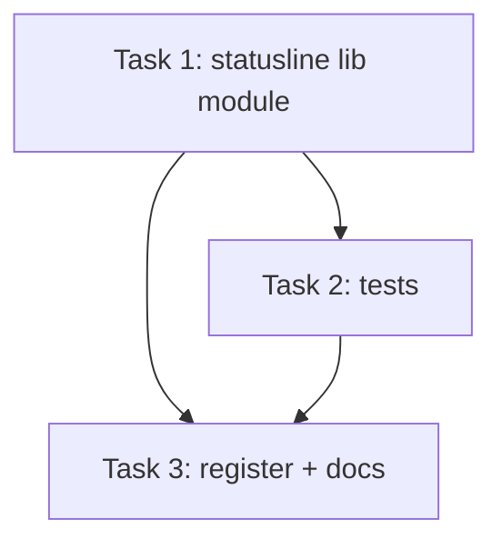

# Statusline Session Report Implementation Plan

> **For agentic workers:** REQUIRED SUB-SKILL: Use man:subagent-driven-development (recommended) or man:executing-plans to implement this plan task-by-task. Steps use checkbox (`- [ ]`) syntax for tracking.

**Goal:** Add a persistent statusline footer to mankit showing: model name, context usage %, current folder, and git branch.

**Architecture:** Claude Code's `statusLine` setting runs a script on each prompt, piping JSON on stdin with all session metadata. We create a Python script that reads this JSON and formats a compact one-line status. Register it in `plugin.json` or document manual setup for `settings.json`.

**Tech Stack:** Python 3 (matching existing hooks/lib pattern), JSON stdin parsing

## Task DAG



---

### Task 1: Create statusline Python script

**Depends on:** none

**Files:**
- Create: `hooks/lib/statusline.py`
- Create: `hooks/claude/statusline.py`

**Context:** Claude Code pipes JSON to statusline scripts on stdin. Key fields:
- `model` — model name string (e.g. `"claude-opus-4-6"`)
- `context_window.used_percentage` — int 0-100
- `workspace.cwd` — current working directory string
- `workspace.git_branch` — current git branch string

The script reads stdin JSON, extracts fields, prints formatted one-liner to stdout.

- [ ] **Step 1: Create the lib module `hooks/lib/statusline.py`**

```python
"""Statusline renderer — formats session metadata for Claude Code footer."""
from __future__ import annotations
import json
import os
import sys


def _short_model(model: str) -> str:
    """Shorten model ID: 'claude-opus-4-6' -> 'opus-4.6'."""
    m = (model or "unknown").lower()
    for prefix in ("claude-", "anthropic/"):
        if m.startswith(prefix):
            m = m[len(prefix):]
    return m.replace("-", ".", 1) if "-" in m else m


def _short_path(cwd: str) -> str:
    """Shorten CWD to last 2 path components."""
    if not cwd:
        return "?"
    parts = cwd.replace("\\", "/").rstrip("/").split("/")
    return "/".join(parts[-2:]) if len(parts) >= 2 else parts[-1]


def render(data: dict) -> str:
    """Render statusline string from Claude Code stdin JSON."""
    model = _short_model(data.get("model", ""))
    ctx_pct = data.get("context_window", {}).get("used_percentage", 0)
    ws = data.get("workspace", {})
    cwd = _short_path(ws.get("cwd", ""))
    branch = ws.get("git_branch", "")

    parts = [
        f"[{model}]",
        f"ctx:{ctx_pct}%",
        f"📂 {cwd}",
    ]
    if branch:
        parts.append(f"⎇ {branch}")

    return " │ ".join(parts)


def main() -> None:
    """Entry point: read JSON from stdin, print statusline to stdout."""
    try:
        raw = sys.stdin.read()
        if not raw.strip():
            return
        data = json.loads(raw)
        line = render(data)
        if line:
            sys.stdout.write(line)
    except Exception:
        pass
```

- [ ] **Step 2: Create thin entrypoint `hooks/claude/statusline.py`**

```python
"""Statusline hook entrypoint — thin wrapper over lib/statusline.py."""
import os
import sys

sys.path.insert(0, os.path.join(os.path.dirname(__file__), ".."))
from lib.statusline import main

if __name__ == "__main__":
    main()
```

- [ ] **Step 3: Manual smoke test**

Run (PowerShell):
```powershell
echo '{"model":"claude-opus-4-6","context_window":{"used_percentage":42},"workspace":{"cwd":"D:/projects/craftpowers","git_branch":"main"}}' | python hooks/claude/statusline.py
```

Expected output:
```
[opus-4.6] │ ctx:42% │ 📂 projects/craftpowers │ ⎇ main
```

- [ ] **Step 4: Commit**

```bash
git add hooks/lib/statusline.py hooks/claude/statusline.py
git commit -m "feat(statusline): add session report footer renderer"
```

---

### Task 2: Write tests

**Depends on:** Task 1

**Files:**
- Create: `tests/test_statusline.py`

- [ ] **Step 1: Write unit tests for render and helpers**

```python
"""Tests for hooks/lib/statusline.py."""
import sys
import os
sys.path.insert(0, os.path.join(os.path.dirname(__file__), "..", "hooks"))

from lib.statusline import render, _short_model, _short_path


class TestShortModel:
    def test_full_claude_id(self):
        assert _short_model("claude-opus-4-6") == "opus-4.6"

    def test_opus_47(self):
        assert _short_model("claude-opus-4-7") == "opus-4.7"

    def test_sonnet(self):
        assert _short_model("claude-sonnet-4-6") == "sonnet-4.6"

    def test_haiku(self):
        assert _short_model("claude-haiku-4-5-20251001") == "haiku-4.5-20251001"

    def test_empty(self):
        assert _short_model("") == "unknown"

    def test_none(self):
        assert _short_model(None) == "unknown"


class TestShortPath:
    def test_deep_path(self):
        assert _short_path("D:/projects/craftpowers") == "projects/craftpowers"

    def test_backslash(self):
        assert _short_path("C:\\Users\\anhdt\\code") == "anhdt/code"

    def test_single_component(self):
        assert _short_path("/root") == "root"

    def test_empty(self):
        assert _short_path("") == "?"


class TestRender:
    def test_full_data(self):
        data = {
            "model": "claude-opus-4-6",
            "context_window": {"used_percentage": 42},
            "workspace": {
                "cwd": "D:/projects/craftpowers",
                "git_branch": "main"
            }
        }
        result = render(data)
        assert "[opus-4.6]" in result
        assert "ctx:42%" in result
        assert "projects/craftpowers" in result
        assert "main" in result

    def test_no_branch(self):
        data = {
            "model": "claude-opus-4-6",
            "context_window": {"used_percentage": 10},
            "workspace": {"cwd": "/home/user/project"}
        }
        result = render(data)
        assert "⎇" not in result

    def test_empty_data(self):
        result = render({})
        assert "[unknown]" in result
        assert "ctx:0%" in result

    def test_zero_context(self):
        data = {
            "model": "claude-sonnet-4-6",
            "context_window": {"used_percentage": 0},
            "workspace": {"cwd": "/app", "git_branch": "feat/x"}
        }
        result = render(data)
        assert "ctx:0%" in result
        assert "⎇ feat/x" in result
```

- [ ] **Step 2: Run tests**

```bash
python -m pytest tests/test_statusline.py -v
```

Expected: All PASS

- [ ] **Step 3: Commit**

```bash
git add tests/test_statusline.py
git commit -m "test(statusline): add unit tests for statusline renderer"
```

---

### Task 3: Register statusline and document setup

**Depends on:** Task 1, Task 2

**Files:**
- Modify: `CLAUDE.md` (add statusline setup docs)
- Modify: `hooks/hooks.json` (no change needed — statusline is a settings.json config, not a hook event)

**Context:** Unlike hooks (which go in `hooks.json`), the `statusLine` is a top-level setting in `settings.json`. The plugin cannot auto-register it — user must add it to their `settings.json` manually, or we add a setup skill/command. For now: document setup.

- [ ] **Step 1: Add statusline section to CLAUDE.md**

Add under `## Maintainer Notes` or a new `## Statusline` section:

```markdown
### Statusline (footer)

Shows model, context usage %, current folder, and git branch in Claude Code footer.

**Setup** — add to `~/.claude/settings.json`:
```json
{
  "statusLine": {
    "type": "command",
    "command": "python \"<plugin-path>/hooks/claude/statusline.py\""
  }
}
```

Replace `<plugin-path>` with the craftpowers install path (e.g. `D:/projects/craftpowers`).

Output example: `[opus-4.6] │ ctx:42% │ 📂 projects/craftpowers │ ⎇ main`
```

- [ ] **Step 2: Commit**

```bash
git add CLAUDE.md
git commit -m "docs(statusline): add setup instructions for session report footer"
```

---

## Notes

- **No new dependencies** — pure Python stdlib (json, sys, os)
- **Follows existing pattern** — thin entrypoint in `hooks/claude/`, logic in `hooks/lib/`
- **Security** — stdin JSON comes from Claude Code harness, no user-controlled input to sanitize
- **Plugin registration** — `statusLine` is a settings.json feature, not a hook event. Cannot auto-register from plugin.json. Future: could add a `man-statusline-setup` skill similar to caveman's `statusline-setup` agent
- **Extensibility** — `render()` function easy to extend with more fields (rate_limits, effort level, thinking mode, etc.)
