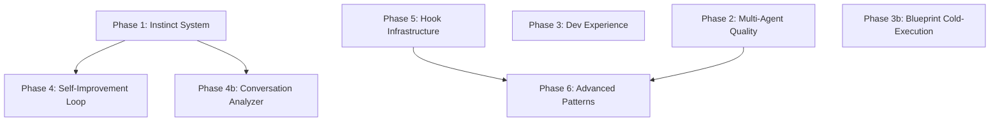

# ECC Patterns Adoption — Full Implementation Plan

> **For agentic workers:** REQUIRED SUB-SKILL: Use man:subagent-driven-development (recommended) or man:executing-plans to implement this plan task-by-task. Steps use checkbox (`- [ ]`) syntax for tracking.

**Goal:** Adopt 14 high-value patterns from ECC reverse engineering into Mankit — instinct system, multi-agent quality patterns, developer experience improvements, self-improvement loop, and advanced orchestration.

**Architecture:** 6 phases ordered by dependency. Phase 1 (foundation) unlocks Phase 4 (self-improvement). Phases 2, 3, 5 are independent of each other. Phase 6 depends on mature hook/skill infrastructure from prior phases.

**Tech Stack:** Python (hooks), Markdown (skills/agents), JSON (config), YAML (instincts)

**Source:** `plans/reports/ecc-tinh-tuy-synthesis.md`, `plans/reports/ecc-improvement-proposals.md`

## Task DAG

## Phases Overview

| Phase | Items | Effort | Dependencies |
|-------|-------|--------|-------------|
| 1. Foundation | P5 Instinct System ✅ | 1-2 days | None |
| 2. Multi-Agent Quality | T4 Anti-anchoring ✅, T5 Santa-method ✅, T6 Iterative retrieval ✅ | 1-2 days | None (parallel with Phase 1) |
| 3. Developer Experience | T7 Write-time quality ✅, T9 Blueprint cold-execution ✅, P11 Stack auto-detection ✅ | 1-2 days | None (parallel) |
| 4. Self-Improvement Loop | P8 Conversation analyzer ✅, P6 Behavioral compliance ✅ | 2-3 days | Phase 1 (instincts) |
| 5. Hook Infrastructure | P7 Dispatcher consolidation, P10 Hook profiles, T8 Hookify | 3-5 days | None (parallel) |
| 6. Advanced | P9 Sub-skill architecture, P12 GAN adversarial | 2-3 weeks | Phases 2, 5 |

**Total estimated effort:** 4-6 weeks

---

Detailed phase files:

- [Phase 1: Instinct System](phase-01-instinct-system.md) — P5
- [Phase 2: Multi-Agent Quality](phase-02-multi-agent-quality.md) — T4, T5, T6
- [Phase 3: Developer Experience](phase-03-developer-experience.md) — T7, T9, P11
- [Phase 4: Self-Improvement Loop](phase-04-self-improvement-loop.md) — P8, P6
- [Phase 5: Hook Infrastructure](phase-05-hook-infrastructure.md) — P7, P10, T8
- [Phase 6: Advanced Patterns](phase-06-advanced-patterns.md) — P9, P12
