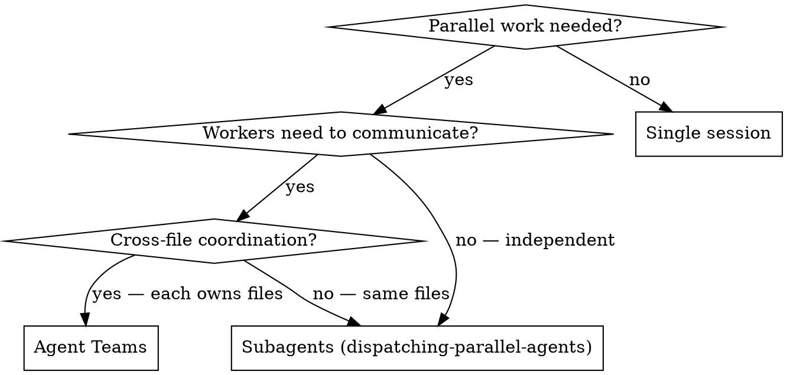

# Agent Teams

## Overview

Agent Teams orchestrate multiple full Claude Code sessions that coordinate through a shared task list. Each teammate is a persistent session with its own context window and git worktree — they can communicate, claim tasks, and work in parallel without merge conflicts.

**Core principle:** Use Agent Teams when teammates need to **talk to each other**. Use subagents when they don't.

**Requires:** `CLAUDE_CODE_EXPERIMENTAL_AGENT_TEAMS=1` env var in settings.json (experimental, disabled by default).

## Proactive Trigger (Hybrid Mode)

This skill activates in two ways:

**1. Cross-reference from dispatching-parallel-agents:** When that skill is active and detects tasks requiring coordination (not independent), it redirects here.

**2. Proactive pattern recognition:** When you detect any of these 3 patterns in your human partner's request, **suggest Agent Teams and ASK before proceeding** — never auto-spawn:

| Pattern | Signal phrases | Suggestion |
|---------|---------------|------------|
| Cross-layer feature | "frontend and backend", "API + UI", "full-stack", spans 3+ directories | "This spans multiple layers — want to use Agent Teams so each layer gets its own session?" |
| Multi-perspective review | "review thoroughly", "security and performance", "check everything" | "Want me to spawn parallel reviewers (security, performance, coverage) with Agent Teams?" |
| Competing-hypothesis debug | "intermittent", "not sure why", "could be X or Y", multiple possible causes | "Multiple possible causes — want Agent Teams to investigate each hypothesis in parallel?" |

**CRITICAL:** Always ASK. Never spawn a team without explicit approval. Agent Teams cost 3-4x tokens.

**If partner declines:** Fall back to subagents or single session. No pressure.

## When to Use



**Use Agent Teams for:**
- Cross-layer features (frontend + backend + tests, each owned by different teammate)
- Multi-perspective code review (security + performance + coverage reviewers)
- Competing-hypothesis debugging (each teammate tests a different theory)
- New modules where teammates each own a separate piece

**Use Subagents instead when:**
- Tasks are independent fire-and-forget (research, grep, test runs)
- No communication needed between workers
- You want minimal token overhead
- Workers would edit the same files (Agent Teams use worktrees — merging is manual)

**Never use Agent Teams for:**
- Sequential tasks with dependencies (just do them in order)
- Same-file edits (merge conflicts guaranteed)
- Simple tasks a single session handles fine
- Rate-limited subscriptions where 3-4x token usage is prohibitive

## Setup

Enable in your project or user settings:

```json
// .claude/settings.json
{
  "env": {
    "CLAUDE_CODE_EXPERIMENTAL_AGENT_TEAMS": "1"
  }
}
```

Optionally configure in `~/.claude.json`:

```json
{
  "teammateDefaultModel": "sonnet",
  "teammateMode": "inProcess"
}
```

## Team Workflow

### Step 1: Create Team

```
TeamCreate({
  team_name: "feature-profile",
  description: "Implement user profile feature"
})
```

### Step 2: Create Shared Tasks

```
TaskCreate({
  subject: "Build API endpoints",
  description: "Create GET/POST /api/profile endpoints..."
})
TaskCreate({
  subject: "Build React components",
  description: "Create ProfilePage, ProfileForm components..."
})
TaskCreate({
  subject: "Write integration tests",
  description: "Test API + UI integration..."
})
```

Use TaskUpdate to set dependencies:
```
TaskUpdate({ id: 3, blockedBy: [1, 2] })
```

### Step 3: Spawn Teammates

Each teammate is a full Claude Code session. Use tam quốc agents:

```
Agent({
  team_name: "feature-profile",
  name: "backend",
  subagent_type: "man:trieu-van",
  prompt: "You are the backend implementer. Check TaskList for tasks assigned to you. Complete each task, mark DONE via TaskUpdate, then check for more work."
})

Agent({
  team_name: "feature-profile",
  name: "frontend",
  subagent_type: "man:trieu-van",
  prompt: "You are the frontend implementer. Check TaskList for tasks assigned to you. Complete each task, mark DONE via TaskUpdate, then check for more work."
})

Agent({
  team_name: "feature-profile",
  name: "reviewer",
  subagent_type: "man:phap-chinh",
  prompt: "You are the code reviewer. Watch TaskList. When implementation tasks complete, review the changes and report findings via SendMessage to the lead."
})
```

Assign tasks to teammates:
```
TaskUpdate({ id: 1, owner: "backend" })
TaskUpdate({ id: 2, owner: "frontend" })
```

### Step 4: Monitor & Coordinate

As lead, you:
- Receive messages automatically from teammates (no polling needed)
- Use SendMessage to redirect, unblock, or assign new work:

```
SendMessage({
  to: "frontend",
  summary: "API contract ready",
  message: "Backend finished the API. Endpoints: GET /api/profile, POST /api/profile. Schema: { name: string, email: string, avatar_url: string }. You can start integration now."
})
```

- Check progress via TaskList
- If reviewer finds issues:

```
SendMessage({
  to: "backend",
  summary: "Fix review findings",
  message: "Reviewer found SQL injection in profile update endpoint. Use parameterized queries instead of string interpolation. See task #4 for details."
})
```

### Step 5: Shutdown

When all tasks complete:

```
SendMessage({
  to: "backend",
  message: { type: "shutdown_request" }
})
SendMessage({
  to: "frontend",
  message: { type: "shutdown_request" }
})
SendMessage({
  to: "reviewer",
  message: { type: "shutdown_request" }
})
```

Run final test suite, ask user to commit.

## Lead Responsibilities

| Responsibility | How |
|----------------|-----|
| Create team | `TeamCreate({ team_name, description })` |
| Define work | `TaskCreate` for each task, `TaskUpdate` for dependencies |
| Spawn teammates | `Agent({ team_name, name, subagent_type, prompt })` |
| Assign tasks | `TaskUpdate({ id, owner: "teammate-name" })` |
| Monitor progress | `TaskList` — check periodically |
| Coordinate | `SendMessage` to redirect, unblock, share findings |
| Handle idle | Teammates go idle after each turn — normal. SendMessage wakes them |
| Shutdown | `SendMessage({ message: { type: "shutdown_request" } })` to each |

## Lead Loop

The lead is not a passive coordinator. Run this loop until Definition of Done:

```
1. PLAN
   - TaskCreate for every known work item
   - TaskUpdate({ addBlockedBy }) to encode dependencies
   - Decide topology (hub-and-spoke by default, see ## Messaging Topology)

2. SPAWN (spawn-on-unblock — never spawn blocked teammates)
   - For each task with no blockedBy and no owner: spawn one teammate
   - Set teammate prompt: role + task ref + minimum context (persona auto-loads Team Mode)

3. MONITOR (every coordination round)
   - Process incoming teammate messages (auto-delivered between turns)
   - TaskList to see status drift
   - If a teammate has been silent for >3 rounds since last message: nudge (see ## Failure & Timeout Policy)

4. COORDINATE
   - Relay reviewer findings to implementer (hub-and-spoke)
   - SendMessage to unblock, share contracts, redirect scope
   - When a previously-blocked task is now unblocked: SPAWN its owner

5. SYNTHESIZE
   - Read shared artifacts (.team/<team-name>/*) when handoffs happen
   - Keep a running mental model of who owns what and what's done

6. GATE — check ## Definition of Done before shutdown

7. SHUTDOWN
   - SendMessage({ to: <each teammate>, message: { type: "shutdown_request" } })
   - Run final verification (tests, build)
   - Report synthesis to user; ask before TeamDelete
```

**Coordination round cap:** `max_coordination_rounds = 10`. A round = one cycle of MONITOR→COORDINATE→SPAWN. If the team has not progressed (no task transition to `completed`) for 10 rounds, **stop and escalate to the human partner** — the team is stuck or the plan is wrong.

## Task Claim Protocol

Two teammates may try to claim the same task simultaneously. The protocol:

```
1. TaskList → filter status=pending, owner empty, blockedBy empty
2. Pick lowest ID (lowest ID first — earlier tasks set up context)
3. TaskUpdate({ taskId, owner: "<my-name>", status: "in_progress" })
4. If the next TaskList shows another teammate owns that ID (race lost):
     → TaskList again, pick the next available, retry
5. If no task available but tasks remain blocked:
     → SendMessage lead with status, then idle
```

The server is authoritative — there is no separate lock. A late claim simply means you missed the race; go pick the next unowned task.

## Messaging Topology

| Topology | When | Rule |
|----------|------|------|
| **Hub-and-spoke** (default) | Teams of 2–3 teammates, or any team where lead must stay coherent | Teammates → lead → relay. No peer DMs. |
| **Mesh** (peer-to-peer) | 4+ teammates AND lead explicitly planned who-talks-to-who | Peer DM allowed only for documented pairs |

Default to hub-and-spoke. Reasons: lead has the full picture; debugging coordination bugs is much harder when DMs bypass the lead; rework risk drops because all decisions converge.

Switch to mesh only when hub-and-spoke creates a relay bottleneck and you have explicitly designed the DM graph.

## Failure & Timeout Policy

| Condition | Lead action |
|-----------|-------------|
| Teammate silent > 3 coordination rounds | `SendMessage` nudge: "status?" |
| 2 nudges, no response | Reassign task (`TaskUpdate` owner) OR ask human partner |
| Teammate reports stuck | Decide: unblock with info, reassign, or escalate to human |
| Reviewer rejects same fix twice | Stop loop. Ask human partner before a 3rd attempt |
| `max_coordination_rounds` exceeded | Stop. Report state to human. Do not loop indefinitely |

A nudge that goes unanswered is data — treat it as a stuck teammate, not as a comm bug.

## Definition of Done

Lead MUST verify all of the following before shutting down teammates:

- [ ] Every task in TaskList is `status=completed` (none `in_progress` or `pending`)
- [ ] If team has a reviewer role: reviewer's task completion summary states `APPROVE` (not a list of issues)
- [ ] Tests pass — if the team's goal touches code that has tests
- [ ] Lead has synthesized findings into a summary suitable for the user

If any item is false: do NOT shutdown. Loop back to COORDINATE — relay issues, spawn rework, or escalate.

## Shared Artifacts

For output larger than ~500 tokens (large diffs, logs, design docs, long traces):

- Write to `.team/<team-name>/<artifact-name>.md` inside the worktree
- `SendMessage` carries the **path**, not the content
- Lead `Read`s the artifact when synthesizing or relaying

This keeps the message channel cheap and avoids re-quoting big blobs through every relay hop.

## Coordination Patterns

### Cross-Layer Feature (frontend + backend + tests) — spawn on unblock

```
TeamCreate({ team_name: "feature-X" })

# Create tasks with dependencies
TaskCreate({ subject: "Define API contract" })           # Task 1
TaskCreate({ subject: "Implement backend endpoints" })    # Task 2
TaskCreate({ subject: "Implement frontend components" })  # Task 3
TaskCreate({ subject: "Write integration tests" })        # Task 4
TaskUpdate({ taskId: "2", addBlockedBy: ["1"] })
TaskUpdate({ taskId: "3", addBlockedBy: ["1"] })
TaskUpdate({ taskId: "4", addBlockedBy: ["2", "3"] })

# Lead handles Task 1 itself (API contract — needs judgment)
# After Task 1 completed: Tasks 2 and 3 are unblocked → spawn backend + frontend
Agent({ team_name: "feature-X", name: "backend",  subagent_type: "man:trieu-van", ... })
Agent({ team_name: "feature-X", name: "frontend", subagent_type: "man:trieu-van", ... })

# After Tasks 2 + 3 completed: Task 4 unblocked → spawn tester
Agent({ team_name: "feature-X", name: "tester", subagent_type: "man:hoang-trung", ... })
```

Spawning blocked teammates upfront wastes a session slot and clutters TaskList ownership. Spawn on unblock — see Lead Loop step 2.

### Multi-Perspective Review

```
TeamCreate({ team_name: "review-PR-42" })

TaskCreate({ subject: "Security review" })
TaskCreate({ subject: "Performance review" })
TaskCreate({ subject: "Coverage review" })

Agent({ team_name: "review-PR-42", name: "security", subagent_type: "man:tu-ma-y", ... })
Agent({ team_name: "review-PR-42", name: "perf", subagent_type: "man:phap-chinh", ... })
Agent({ team_name: "review-PR-42", name: "coverage", subagent_type: "man:hoang-trung", ... })
```

### Competing-Hypothesis Debug

```
TeamCreate({ team_name: "debug-checkout" })

TaskCreate({ subject: "Investigate race condition in cart state" })
TaskCreate({ subject: "Investigate API timeout/retry behavior" })
TaskCreate({ subject: "Investigate DB connection pool exhaustion" })

# All bang-thong agents — each investigates one hypothesis
Agent({ team_name: "debug-checkout", name: "hyp-race", subagent_type: "man:bang-thong", ... })
Agent({ team_name: "debug-checkout", name: "hyp-timeout", subagent_type: "man:bang-thong", ... })
Agent({ team_name: "debug-checkout", name: "hyp-pool", subagent_type: "man:bang-thong", ... })
```

## Cost Awareness

Token usage ≈ **(N teammates + 1) × single session cost**.

| Team size | Relative cost | When justified |
|-----------|---------------|----------------|
| 1 lead + 1 teammate | ~2x | Pair: one builds, one reviews |
| 1 lead + 2 teammates | ~3x | Most common sweet spot |
| 1 lead + 3 teammates | ~4x | Multi-perspective review |
| 1 lead + 4+ teammates | ~5x+ | Rarely justified |

**Cost optimization (see man:effort-tuning for full model selection guide):**
- Set `teammateDefaultModel: "sonnet"` — most teammates are implementers
- Lead stays Opus (coordination needs judgment); upgrade individual teammates to Opus only for review/architecture roles
- Keep teams small (2-3 teammates)
- Shut down teammates when their work is done — don't leave idle sessions
- For routine tasks, subagents are 3-4x cheaper

## Token Optimization

### 1. Model selection per role

Lead stays Opus. Downgrade teammates:

| Role | Model | Why |
|------|-------|-----|
| Lead (coordinator) | Opus | Judgment, coordination |
| Implementer | Sonnet | Mechanical coding |
| Reviewer | Sonnet or Opus | Depends on complexity |
| Research/grep | Haiku | Read-only, simple |

Set default: `teammateDefaultModel: "sonnet"` in `~/.claude.json`.

### 2. Minimal spawn prompts

Teammates auto-load CLAUDE.md, AGENTS.md, skills. Spawn prompt = role + task reference only:

```
# ❌ 2000 tokens — redundant context
"You are an implementer. Here's the full project context, architecture, patterns..."

# ✅ 100 tokens — teammates load context themselves
"You are triệu-vân. Check TaskList for your tasks. Own files in src/api/. Mark DONE via TaskUpdate."
```

### 3. Delta-only SendMessage

Send only what changed, not full context:

```
# ❌ 5000 tokens
SendMessage("Here's everything I found: [full logs, full context]...")

# ✅ 200 tokens
SendMessage("API ready. Endpoints: GET/POST /profile. Schema: {name, email, avatar_url}")
```

### 4. Spawn on unblock, not upfront

See Lead Loop step 2 — this is the canonical rule for spawning. Don't spawn blocked teammates:

```
# ❌ Spawn all 3 upfront — B and C idle while A works
Agent A → working
Agent B → idle (blocked by A) → burning tokens
Agent C → idle (blocked by A,B) → burning tokens

# ✅ Spawn when unblocked
Agent A → working
[A done] → spawn Agent B
[B done] → spawn Agent C
```

### 5. Shutdown immediately after task completion

Idle teammates don't burn tokens per turn (no input → no inference). What they DO consume:
- A team-member slot (lead must track them, send-on-purpose discipline weakens)
- Memory + process footprint on the host
- Risk of stale context — when you finally wake them, they may have drifted from current state

```
Teammate finishes → SendMessage shutdown → clean state
❌ Leave idle "in case we need them" → drift risk + clutter, even though token cost is near zero
```

### 6. Hybrid mode — mix teams with fire-and-forget

Not everything needs a team. In the same session:

| Task type | Mode | Relative cost |
|-----------|------|---------------|
| Independent research | Fire-and-forget subagent (Haiku) | ~0.3x |
| Independent implementation | Fire-and-forget subagent (Sonnet) | ~1x |
| Coordinated cross-layer work | Native Agent Team | ~3-4x |

### Combined impact

All optimizations together reduce Agent Teams from ~4x to ~1.5-2x single session cost.

## Common Mistakes

| Mistake | Fix |
|---------|-----|
| Using teams for independent tasks | Subagents are faster and cheaper when no communication needed |
| Too many teammates (5+) | Coordination overhead exceeds benefit. Start with 2-3 |
| Same-file ownership | Each teammate must own distinct files/directories |
| Forgetting to clean up | Tell lead to shut down teammates when done |
| Expecting `/resume` to restore teammates | It doesn't — spawn fresh teammates after resume |
| Not using TaskUpdate for dependencies | Tasks execute out of order — use `blockedBy` |

## Limitations (Experimental)

One team at a time. No nested teams. Lead is fixed. Task status can lag — nudge if stuck. Permissions inherit from lead at spawn.
