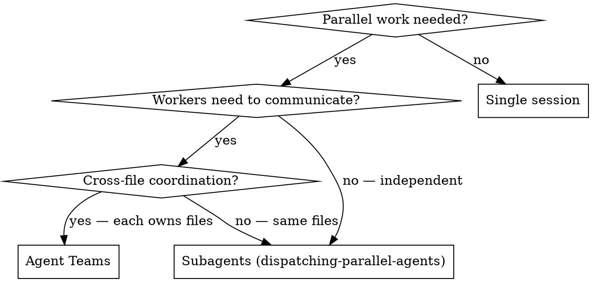

# Agent Teams

## Overview

Agent Teams orchestrate multiple full Claude Code sessions that coordinate through a shared task list. Each teammate is a persistent session with its own context window and git worktree — they can communicate, claim tasks, and work in parallel without merge conflicts.

**Core principle:** Use Agent Teams when teammates need to **talk to each other**. Use subagents when they don't.

**Requires:** `CLAUDE_CODE_EXPERIMENTAL_AGENT_TEAMS=1` env var in settings.json (experimental, disabled by default).

## Proactive Trigger (Hybrid Mode)

This skill activates in two ways:

**1. Cross-reference from dispatching-parallel-agents:** When that skill is active and detects tasks requiring coordination (not independent), it redirects here.

**2. Proactive pattern recognition:** Detect these patterns and ASK before spawning (never auto-spawn):

- **Cross-layer feature** ("frontend and backend", "API + UI", spans 3+ dirs) → "Want Agent Teams so each layer gets its own session?"
- **Multi-perspective review** ("review thoroughly", "check everything") → "Want parallel reviewers with Agent Teams?"
- **Competing-hypothesis debug** ("intermittent", "could be X or Y") → "Want Agent Teams to investigate each hypothesis in parallel?"

**CRITICAL:** Always ASK. Never spawn without explicit approval. Agent Teams cost 3-4x tokens. If partner declines, fall back to subagents.

## When to Use



**Use Agent Teams for:** cross-layer features, multi-perspective review, competing-hypothesis debugging, new modules with distinct ownership.

**Use Subagents instead when:** tasks are independent, no communication needed, workers edit same files.

**Never use for:** sequential tasks, same-file edits, simple single-session tasks, rate-limited subscriptions.

## Setup

Enable in your project or user settings:

```json
// .claude/settings.json
{
  "env": {
    "CLAUDE_CODE_EXPERIMENTAL_AGENT_TEAMS": "1"
  }
}
```

Optionally configure in `~/.claude.json`:

```json
{
  "teammateDefaultModel": "sonnet",
  "teammateMode": "inProcess"
}
```

## Dispatch Mode — Team vs Fire-and-Forget

Check plan DAG first (see writing-plans skill):

| Condition | Mode |
|-----------|------|
| DAG edges == 0 (all independent) | `Agent × N` fire-and-forget |
| DAG linear chain | Sequential Agent dispatch |
| DAG edges ≥ 1, or peer DMs needed | `TeamCreate` |
| Competing-hypothesis or multi-perspective review | `TeamCreate` |

Default to fire-and-forget. Upgrade to TeamCreate only when coordination is required.

## Team Workflow

### Step 1: Create Team

```
TeamCreate({
  team_name: "feature-profile",
  description: "Implement user profile feature"
})
```

### Step 2: Create Shared Tasks

```
TaskCreate({ subject: "Build API endpoints", ... })
TaskCreate({ subject: "Build React components", ... })
TaskCreate({ subject: "Write integration tests", ... })
TaskUpdate({ id: 3, blockedBy: [1, 2] })
```

### Step 3: Spawn Teammates

```
Agent({ team_name: "feature-profile", name: "backend",  subagent_type: "man:implementer", prompt: "..." })
Agent({ team_name: "feature-profile", name: "frontend", subagent_type: "man:implementer", prompt: "..." })
Agent({ team_name: "feature-profile", name: "reviewer", subagent_type: "man:code-reviewer", prompt: "..." })
TaskUpdate({ id: 1, owner: "backend" })
TaskUpdate({ id: 2, owner: "frontend" })
```

### Step 4: Monitor & Coordinate

As lead: receive teammate messages automatically, `SendMessage` to relay findings/unblock, `TaskList` for progress.

### Step 5: Shutdown

```
SendMessage({ to: "backend",  message: { type: "shutdown_request" } })
SendMessage({ to: "frontend", message: { type: "shutdown_request" } })
SendMessage({ to: "reviewer", message: { type: "shutdown_request" } })
```

## Lead Responsibilities

| Responsibility | How |
|----------------|-----|
| Create team | `TeamCreate({ team_name, description })` |
| Define work | `TaskCreate` for each task, `TaskUpdate` for dependencies |
| Spawn teammates | `Agent({ team_name, name, subagent_type, prompt })` |
| Assign tasks | `TaskUpdate({ id, owner: "teammate-name" })` |
| Monitor progress | `TaskList` — check periodically |
| Coordinate | `SendMessage` to redirect, unblock, share findings |
| Handle idle | Teammates go idle after each turn — normal. SendMessage wakes them |
| Shutdown | `SendMessage({ message: { type: "shutdown_request" } })` to each |

## Lead Loop

See `references/lead-loop-full.md` for the complete 9-step lead loop (PLAN→SPAWN→MONITOR→COORDINATE→SYNTHESIZE→REFLECT→GATE→CEO REVIEW→PERSIST STATE→SHUTDOWN) with `plan-state.yaml` format and coordination round cap.

## Session Resume

If a team session died mid-run, any new session can resume:

1. Check for `.team/*/plan-state.yaml` in the repo
2. If found, read it: which tasks are done, who was working, key decisions
3. Re-read the plan file referenced in `plan:` field
4. Resume Lead Loop from SPAWN — only spawn for tasks `pending` or `in_progress` with no owner
5. Tasks marked `completed` are trusted — verify via git log if uncertain

## Task Claim Protocol

```
1. TaskList → filter status=pending, owner empty, blockedBy empty
2. Pick lowest ID (earlier tasks set up context)
3. TaskUpdate({ taskId, owner: "<my-name>", status: "in_progress" })
4. If race lost (another teammate claimed it): pick next available
5. If no task available but tasks remain blocked: SendMessage lead, then idle
```

## Messaging Topology

| Topology | When | Rule |
|----------|------|------|
| **Hub-and-spoke** (default) | Teams of 2–3 teammates | Teammates → lead → relay. No peer DMs. |
| **Mesh** (peer-to-peer) | 4+ teammates, explicit DM graph designed | Peer DM allowed only for documented pairs |

Default to hub-and-spoke. Switch to mesh only when hub-and-spoke creates a bottleneck and you've explicitly designed the DM graph.

## Failure & Timeout Policy

| Condition | Lead action |
|-----------|-------------|
| Teammate silent > 3 coordination rounds | `SendMessage` nudge: "status?" |
| 2 nudges, no response | Reassign task OR ask human partner |
| Teammate reports stuck | Unblock with info, reassign, or escalate |
| Reviewer rejects same fix twice | Stop loop. Ask human partner before 3rd attempt |
| `max_coordination_rounds` exceeded | Stop. Report state to human. Do not loop indefinitely |

## Definition of Done

Lead MUST verify all before shutting down teammates:

- [ ] Every task in TaskList is `status=completed`
- [ ] If reviewer role: `VERDICT: APPROVE` and `CRITICAL:` count is 0
- [ ] Tests pass — if goal touches code that has tests
- [ ] Lead has synthesized findings into a user summary
- [ ] CEO review completed: APPROVE, or FLAG concerns included in summary

## CEO Review — Advisory Final Gate

After Definition of Done, spawn `man:final-approver` as fire-and-forget subagent. Verdicts: APPROVE or FLAG. Skip for trivial runs (1 teammate, < 3 tasks). See `references/lead-loop-full.md` for the full spawn prompt template.

## Shared Artifacts

For output larger than ~500 tokens: write to `.team/<team-name>/<artifact-name>.md`, send the **path** via SendMessage (not the content). Lead reads the artifact when synthesizing.

## Coordination Patterns

See `references/coordination-patterns.md` for full implementations of: cross-layer feature (spawn-on-unblock), multi-perspective review, competing-hypothesis debug with winner-first protocol.

## Cost Awareness

Token usage ≈ **(N teammates + 1) × single session cost**.

| Team size | Relative cost | When justified |
|-----------|---------------|----------------|
| 1 lead + 1 teammate | ~2x | Pair: one builds, one reviews |
| 1 lead + 2 teammates | ~3x | Most common sweet spot |
| 1 lead + 3 teammates | ~4x | Multi-perspective review |
| 1 lead + 4+ teammates | ~5x+ | Rarely justified |

## Token Optimization

See `references/token-optimization.md` for all 6 techniques: model selection per role, minimal spawn prompts, delta-only SendMessage, spawn-on-unblock, immediate shutdown, hybrid mode — with combined impact table (~1.5-2x vs default ~4x).

**Quick rules:** set `teammateDefaultModel: "sonnet"`; keep teams to 2-3 teammates; shut down when done.

## Common Mistakes

| Mistake | Fix |
|---------|-----|
| Using teams for independent tasks | Subagents are faster and cheaper |
| Too many teammates (5+) | Coordination overhead exceeds benefit |
| Same-file ownership | Each teammate must own distinct files/directories |
| Forgetting to clean up | Shut down teammates when done |
| Expecting `/resume` to restore teammates | Spawn fresh teammates after resume |
| Not using TaskUpdate for dependencies | Tasks execute out of order — use `blockedBy` |

## Limitations (Experimental)

One team at a time. No nested teams. Lead is fixed. Task status can lag — nudge if stuck. Permissions inherit from lead at spawn.

## Auto-Dispatch (hook-driven)

`hooks/auto-dispatch.py` watches Claude Code events and surfaces dispatch suggestions automatically. Rules in `hooks/auto-dispatch-rules.json`: event, tool, match conditions, suggested command. Fires `systemMessage` suggestion when rule matches. Non-blocking (exit 0 always) — advises only.
