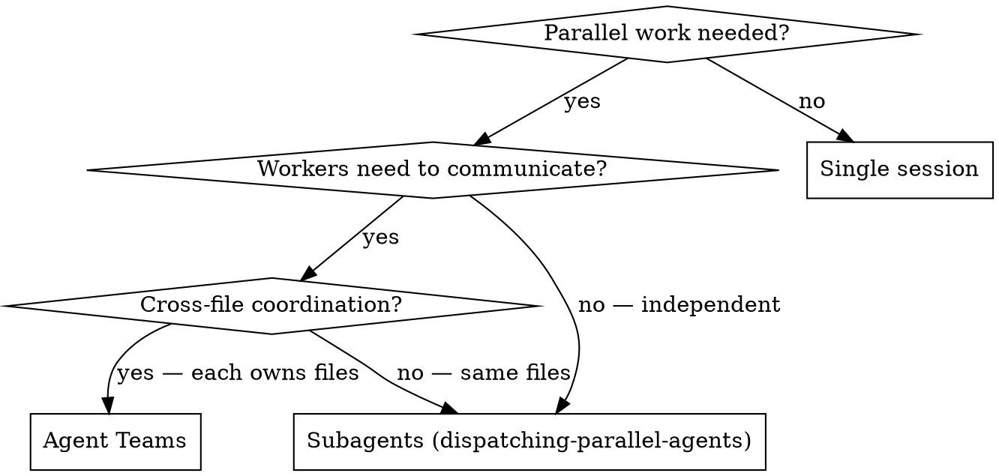

# Agent Teams

## Overview

Agent Teams orchestrate multiple full Claude Code sessions that coordinate through a shared task list. Each teammate is a persistent session with its own context window and git worktree — they can communicate, claim tasks, and work in parallel without merge conflicts.

**Core principle:** Use Agent Teams when teammates need to **talk to each other**. Use subagents when they don't.

**Requires:** `agentTeams: true` in settings.json (experimental, disabled by default).

## Proactive Trigger (Hybrid Mode)

This skill activates in two ways:

**1. Cross-reference from dispatching-parallel-agents:** When that skill is active and detects tasks requiring coordination (not independent), it redirects here.

**2. Proactive pattern recognition:** When you detect any of these 3 patterns in your human partner's request, **suggest Agent Teams and ASK before proceeding** — never auto-spawn:

| Pattern | Signal phrases | Suggestion |
|---------|---------------|------------|
| Cross-layer feature | "frontend and backend", "API + UI", "full-stack", spans 3+ directories | "This spans multiple layers — want to use Agent Teams so each layer gets its own session?" |
| Multi-perspective review | "review thoroughly", "security and performance", "check everything" | "Want me to spawn parallel reviewers (security, performance, coverage) with Agent Teams?" |
| Competing-hypothesis debug | "intermittent", "not sure why", "could be X or Y", multiple possible causes | "Multiple possible causes — want Agent Teams to investigate each hypothesis in parallel?" |

**CRITICAL:** Always ASK. Never spawn a team without explicit approval. Agent Teams cost 3-4x tokens.

**If partner declines:** Fall back to subagents or single session. No pressure.

## When to Use



**Use Agent Teams for:**
- Cross-layer features (frontend + backend + tests, each owned by different teammate)
- Multi-perspective code review (security + performance + coverage reviewers)
- Competing-hypothesis debugging (each teammate tests a different theory)
- New modules where teammates each own a separate piece

**Use Subagents instead when:**
- Tasks are independent fire-and-forget (research, grep, test runs)
- No communication needed between workers
- You want minimal token overhead
- Workers would edit the same files (Agent Teams use worktrees — merging is manual)

**Never use Agent Teams for:**
- Sequential tasks with dependencies (just do them in order)
- Same-file edits (merge conflicts guaranteed)
- Simple tasks a single session handles fine
- Rate-limited subscriptions where 3-4x token usage is prohibitive

## Setup

Enable in your project or user settings:

```json
// .claude/settings.json
{
  "agentTeams": true
}
```

Optionally configure in `~/.claude.json`:

```json
{
  "teammateDefaultModel": "sonnet",
  "teammateMode": "inProcess"
}
```

| Setting | Values | Default | Notes |
|---------|--------|---------|-------|
| `agentTeams` | `true`/`false` | `false` | Required to enable |
| `teammateDefaultModel` | `"sonnet"`, `"haiku"`, `"opus"` | inherits lead | Sonnet recommended for cost |
| `teammateMode` | `"inProcess"`, `"tmux"`, `"auto"` | `"auto"` | Split panes need tmux/iTerm2 |

## Prompt Patterns

### Pattern 1: Cross-Layer Feature

```
Create an agent team for implementing the user profile feature:
- Frontend teammate: build the React components in src/components/profile/
- Backend teammate: build the API endpoints in src/api/profile/
- Test teammate: write integration tests in tests/profile/

Frontend depends on backend API being defined first.
Create the task list with that dependency.
```

### Pattern 2: Multi-Perspective Review

```
Create an agent team to review PR #42. Spawn three reviewers:
- Security: check auth, input validation, data exposure
- Performance: check N+1 queries, caching, bundle size
- Coverage: verify tests cover the new code paths
Have them each review independently, then synthesize findings.
```

### Pattern 3: Competing Hypotheses Debug

```
The checkout flow fails intermittently. Create an agent team:
- Teammate 1: investigate race conditions in cart state
- Teammate 2: investigate API timeout/retry behavior
- Teammate 3: investigate database connection pool exhaustion
Each should gather evidence for their hypothesis and report findings.
```

## Controls Quick Reference

| Action | Shortcut |
|--------|----------|
| Cycle through teammates | `Shift+Down` |
| Toggle task list | `Ctrl+T` |
| View teammate session | `Enter` |
| Interrupt teammate | `Escape` |
| Message teammate | Cycle to them → type |

## Cost Awareness

Token usage ≈ **(N teammates + 1) × single session cost**.

| Team size | Relative cost | When justified |
|-----------|---------------|----------------|
| 1 lead + 1 teammate | ~2x | Pair: one builds, one reviews |
| 1 lead + 2 teammates | ~3x | Most common sweet spot |
| 1 lead + 3 teammates | ~4x | Multi-perspective review |
| 1 lead + 4+ teammates | ~5x+ | Rarely justified |

**Cost optimization:**
- Set `teammateDefaultModel: "sonnet"` — teammates rarely need Opus
- Keep teams small (2-3 teammates)
- Shut down teammates when their work is done — don't leave idle sessions
- For routine tasks, subagents are 3-4x cheaper

## Common Mistakes

**❌ Using teams for independent tasks:** If teammates don't need to communicate, subagents are faster and cheaper.

**❌ Too many teammates:** 5+ teammates means coordination overhead exceeds parallel benefit. Start with 2-3.

**❌ Same-file ownership:** Two teammates editing the same file will create merge conflicts. Each teammate should own distinct files/directories.

**❌ Forgetting to clean up:** Teammates persist until explicitly shut down. Tell the lead to clean up when done, or orphaned tmux sessions accumulate.

**❌ Expecting session resumption:** `/resume` doesn't restore in-process teammates. If you resume, tell the lead to spawn fresh teammates.

## Limitations (Experimental Feature)

- No session resumption for teammates
- Task status can lag — nudge the lead if a task appears stuck
- One team at a time per lead
- No nested teams (teammates can't spawn their own teams)
- Lead cannot be transferred
- Permissions set at spawn (inherits lead's mode)
