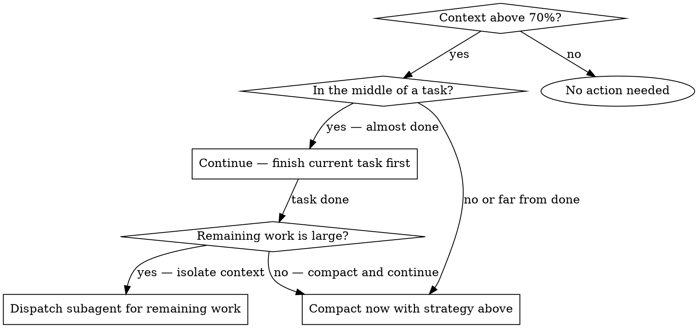

# Context Management

## Overview

Context window is a finite resource. Losing critical state during auto-compaction is the #1 cause of agent confusion mid-task. This skill teaches you to compact **strategically** — preserving what matters, discarding what doesn't, and using subagents to keep your own context lean.

**Core principle:** Compact is not "forget everything" — it's "choose what to remember."

## When This Activates

The `context-tracker` hook fires a systemMessage when context usage crosses thresholds:

| Level | Threshold | What to do |
|-------|-----------|------------|
| Warning | ~70% (140K tokens) | Start planning — finish current task, then compact |
| Critical | ~87% (175K tokens) | Compact NOW — next auto-compaction may lose state |

When you see `[craftpowers/context-tracker]` in a system message, follow the strategy below.

## Compact Strategy

### Step 1: Inventory What Matters

Before running `/compact`, identify state that must survive:

| Category | Examples | How to preserve |
|----------|----------|-----------------|
| **Active plan** | Plan file path, completed tasks, next task | Include in /compact prompt |
| **Branch state** | Current branch, worktree path, base branch | Include in /compact prompt |
| **Key decisions** | "Reviewer said use X not Y", "User wants Z" | Include in /compact prompt |
| **File locations** | Files being edited, test files | Re-read from disk after compact |
| **Git history** | What was already implemented | `git log` after compact |

### Step 2: Run /compact With Context

```
/compact Keep: <what you're doing> via <skill if applicable>.
Completed: <what's done>. Next: <what's next>.
Branch: <branch>. Worktree: <path if applicable>.
Decisions: <key decisions that affect remaining work>.
```

### Step 3: Recover After Compact

1. Re-read plan file from disk (source of truth — never rely on compacted memory for specs)
2. Run `git log --oneline <base>..HEAD` to see what was already implemented
3. Check git status for uncommitted work
4. Resume from next incomplete task

## Proactive Context Hygiene

Don't wait for the warning. These habits keep context lean:

**Offload to subagents:** Research, grep, file exploration — anything read-only that produces large output. Subagent context doesn't pollute yours; only their summary returns.

**Commit frequently:** Committed code is recoverable via git. Uncommitted changes are lost if context compacts and you forget the file path.

**Don't re-read files unnecessarily:** If you just wrote a file, don't read it back to verify. The Edit/Write tool would have errored if it failed.

**Summarize before moving on:** After completing a sub-task, write a 1-2 line summary of what changed. This survives compaction better than raw tool output.

## Decision: Compact vs. Subagent vs. Continue



## Workflow-Specific Additions

When using **subagent-driven-development** or **executing-plans**, also preserve:
- Plan file path (re-read after compact)
- Task completion state (by number)
- Review decisions that affect later tasks

When using **agent-teams**, the lead's context is the bottleneck:
- Delegate heavy investigation to teammates
- Lead should only hold coordination state
- Compact lead context between team phases

## Common Mistakes

| Mistake | Fix |
|---------|-----|
| Running /compact with no context prompt | Always specify what to keep |
| Trusting compacted memory for task specs | Re-read plan file from disk |
| Ignoring warning until critical | Start planning compact at 70% |
| Keeping large tool outputs in context | Use subagents for research-heavy work |
| Not checking git after compact | Run `git log` and `git status` to recover state |
