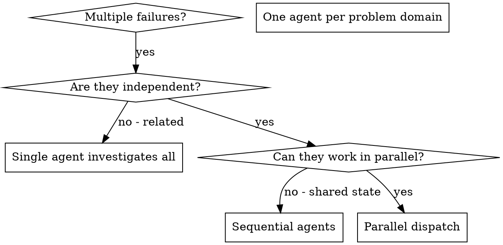

# Dispatching Parallel Agents

## Overview

You delegate tasks to specialized agents with isolated context. By precisely crafting their instructions and context, you ensure they stay focused and succeed at their task. They should never inherit your session's context or history — you construct exactly what they need. This also preserves your own context for coordination work.

When you have multiple unrelated failures (different test files, different subsystems, different bugs), investigating them sequentially wastes time. Each investigation is independent and can happen in parallel.

**Core principle:** Dispatch one agent per independent problem domain. Let them work concurrently.

## Agent Type Selection

**MANDATORY:** Always specify `subagent_type` when dispatching. Use tam quốc agents:

| Task | `subagent_type` |
|------|----------------|
| Scout / read-only explore | `gia-cat-luong` |
| Implement / write code | `trieu-van` |
| Debug / fix bug | `bang-thong` |
| Code review | `phap-chinh` |
| Security review | `tu-ma-y` |
| Quick 1-2 file fix | `truong-phi` |
| Tests / coverage | `hoang-trung` |
| Docs | `ma-luong` |
| Release prep | `luu-bi` |
| Journal | `quan-vu` |
| Final approval gate | `tao-thao` |

`cavecrew-*` agents: only when compressed output is critical for context budget.

## When to Use



**Use when:**
- 3+ test files failing with different root causes
- Multiple subsystems broken independently
- Each problem can be understood without context from others
- No shared state between investigations

**Don't use when:**
- Failures are related (fix one might fix others)
- Need to understand full system state
- Agents would interfere with each other

## The Pattern

### 1. Identify Independent Domains

Group failures by what's broken:
- File A tests: Tool approval flow
- File B tests: Batch completion behavior
- File C tests: Abort functionality

Each domain is independent - fixing tool approval doesn't affect abort tests.

### 2. Create Focused Agent Tasks

Each agent gets:
- **Specific scope:** One test file or subsystem
- **Clear goal:** Make these tests pass
- **Constraints:** Don't change other code
- **Expected output:** Summary of what you found and fixed
- **Model:** Choose per task — see man:effort-tuning (Haiku for grep/research, Sonnet for implementation, Opus for debugging)

### 3. Dispatch in Parallel

```typescript
// In Claude Code / AI environment
Task("Fix agent-tool-abort.test.ts failures")
Task("Fix batch-completion-behavior.test.ts failures")
Task("Fix tool-approval-race-conditions.test.ts failures")
// All three run concurrently
```

### 3a. Foreground vs Background Mode

Pass `run_in_background: true` to the `Agent` tool when dispatching parallel agents whose tool prompts you do NOT want bubbling to the user.

| Mode | Behavior | Use when |
|------|----------|----------|
| Foreground (default) | Permission prompts surface to user mid-task; user can approve/deny per-call | Single agent, user available, novel tool calls expected |
| Background (`run_in_background: true`) | No prompts — any tool call that would prompt is auto-denied; agent continues without that tool | Parallel dispatch, agent has narrow `tools` allowlist, you can't field N prompts at once |

Pair background mode with a tight `tools` field in the agent's frontmatter (or `disallowedTools` at dispatch) so the agent never reaches for a tool that would auto-deny.

### 3b. Worktree Isolation

When parallel agents would touch overlapping files (competing implementations, multiple impl attempts, conflicting refactors), wrap each dispatch in `isolation: "worktree"`. Each agent gets its own git worktree branch — no merge conflicts, no shared state corruption.

```typescript
Agent({
  subagent_type: "man:trieu-van",
  isolation: "worktree",
  prompt: "Implement variant A: ..."
})
Agent({
  subagent_type: "man:trieu-van",
  isolation: "worktree",
  prompt: "Implement variant B: ..."
})
// Each runs in a separate worktree; pick the winner, discard the rest
```

**Note:** `EnterWorktree` / `ExitWorktree` are NOT available to subagents themselves. Only the dispatching main agent can create worktrees via the `Agent` tool's `isolation` parameter.

**When to combine background + worktree:** racing multiple implementations of the same feature — each in isolated worktree, all background, lead picks winner from diffs.

### 3c. Monitor CI / Long Tasks During Dispatch

When parallel agents kick off long-running CI or test jobs, attach a `Monitor` so each new log line / status change flows back to the lead automatically — no polling, no blocking. Monitor is bash-permission-scoped; same allow/deny rules apply.

```typescript
// Lead starts CI watcher before dispatching impl agents
Monitor({
  command: "gh pr checks --watch",
  description: "PR check status"
})

// Dispatch agents in parallel; CI events interject when relevant
Agent({ subagent_type: "man:trieu-van", run_in_background: true, ... })
```

Plugin-declared monitors (see `.claude-plugin/plugin.json` `experimental.monitors`) auto-start on skill invocation — preferred over manual `Monitor()` calls when the trigger is deterministic.

### 4. Review and Integrate

When agents return:
- Read each summary
- Verify fixes don't conflict
- Run full test suite
- Integrate all changes

## Agent Prompt Structure

Good agent prompts are:
1. **Focused** - One clear problem domain
2. **Self-contained** - All context needed to understand the problem
3. **Specific about output** - What should the agent return?

```markdown
Fix the 3 failing tests in src/agents/agent-tool-abort.test.ts:

1. "should abort tool with partial output capture" - expects 'interrupted at' in message
2. "should handle mixed completed and aborted tools" - fast tool aborted instead of completed
3. "should properly track pendingToolCount" - expects 3 results but gets 0

These are timing/race condition issues. Your task:

1. Read the test file and understand what each test verifies
2. Identify root cause - timing issues or actual bugs?
3. Fix by:
   - Replacing arbitrary timeouts with event-based waiting
   - Fixing bugs in abort implementation if found
   - Adjusting test expectations if testing changed behavior

Do NOT just increase timeouts - find the real issue.

Return: Summary of what you found and what you fixed.
```

## Common Mistakes

**❌ Too broad:** "Fix all the tests" - agent gets lost
**✅ Specific:** "Fix agent-tool-abort.test.ts" - focused scope

**❌ No context:** "Fix the race condition" - agent doesn't know where
**✅ Context:** Paste the error messages and test names

**❌ No constraints:** Agent might refactor everything
**✅ Constraints:** "Do NOT change production code" or "Fix tests only"

**❌ Vague output:** "Fix it" - you don't know what changed
**✅ Specific:** "Return summary of root cause and changes"

## When NOT to Use

**Related failures:** Fixing one might fix others - investigate together first
**Need full context:** Understanding requires seeing entire system
**Exploratory debugging:** You don't know what's broken yet
**Shared state:** Agents would interfere (editing same files, using same resources)

**Need coordination between workers?** Use man:agent-teams instead — teammates share a task list and communicate directly.

**Redirect rule:** If you're about to dispatch parallel agents and notice tasks have dependencies or need cross-layer coordination, STOP. Suggest Agent Teams to your human partner first:
- "These tasks need coordination — want to use Agent Teams instead of independent subagents?"

## Real Example from Session

**Scenario:** 6 test failures across 3 files after major refactoring

**Failures:**
- agent-tool-abort.test.ts: 3 failures (timing issues)
- batch-completion-behavior.test.ts: 2 failures (tools not executing)
- tool-approval-race-conditions.test.ts: 1 failure (execution count = 0)

**Decision:** Independent domains - abort logic separate from batch completion separate from race conditions

**Dispatch:**
```
Agent 1 → Fix agent-tool-abort.test.ts
Agent 2 → Fix batch-completion-behavior.test.ts
Agent 3 → Fix tool-approval-race-conditions.test.ts
```

**Results:**
- Agent 1: Replaced timeouts with event-based waiting
- Agent 2: Fixed event structure bug (threadId in wrong place)
- Agent 3: Added wait for async tool execution to complete

**Integration:** All fixes independent, no conflicts, full suite green

**Time saved:** 3 problems solved in parallel vs sequentially

## Key Benefits

1. **Parallelization** - Multiple investigations happen simultaneously
2. **Focus** - Each agent has narrow scope, less context to track
3. **Independence** - Agents don't interfere with each other
4. **Speed** - 3 problems solved in time of 1

## Verification

After agents return:
1. **Review each summary** - Understand what changed
2. **Check for conflicts** - Did agents edit same code?
3. **Run full suite** - Verify all fixes work together
4. **Spot check** - Agents can make systematic errors

## Real-World Impact

From debugging session (2025-10-03):
- 6 failures across 3 files
- 3 agents dispatched in parallel
- All investigations completed concurrently
- All fixes integrated successfully
- Zero conflicts between agent changes
