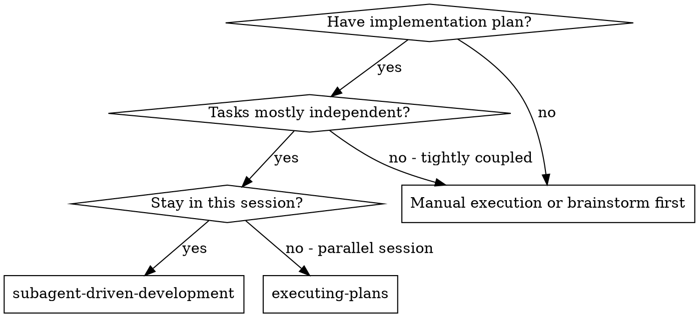
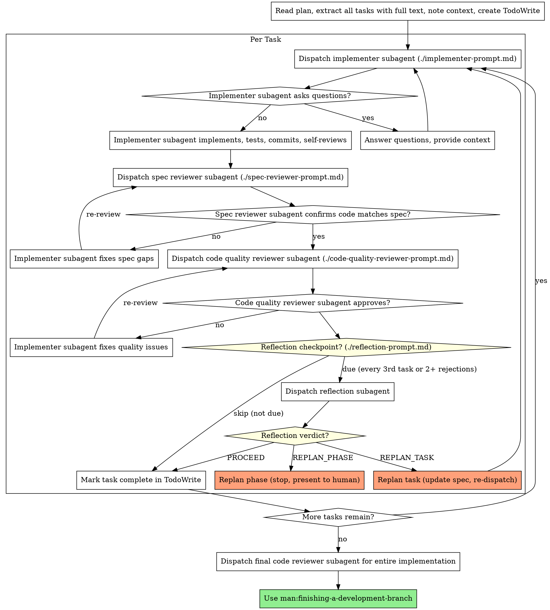

# Subagent-Driven Development

Execute plan by dispatching fresh subagent per task, with two-stage review after each: spec compliance review first, then code quality review.

**Why subagents:** You delegate tasks to specialized agents with isolated context. By precisely crafting their instructions and context, you ensure they stay focused and succeed at their task. They should never inherit your session's context or history — you construct exactly what they need. This also preserves your own context for coordination work.

**Core principle:** Fresh subagent per task + two-stage review (spec then quality) = high quality, fast iteration

## Dispatch Modes

This skill supports three dispatch modes. The mode is chosen during the Execution Handoff in writing-plans.

### Team Agents — Native Team (recommended for coordinated work)

Use when tasks have cross-dependencies, need inter-agent communication, or span multiple layers.

Creates a real Agent Team using TeamCreate/SendMessage/shared TaskList. Teammates are persistent sessions that coordinate through the shared task list and direct messages.

**REQUIRED SUB-SKILL:** Use man:agent-teams for the full Team Workflow.

| Task Type | subagent_type | Agent | Model |
|-----------|--------------|-------|-------|
| Implement | `man:implementer` | triệu-vân | Sonnet |
| Debug | `man:debugger` | bàng-thống | Opus |
| Code review | `man:code-reviewer` | pháp-chính | Opus |
| Security review | `man:secure-reviewer` | tư-mã-ý | Opus |
| Explore codebase | `man:codebase-explorer` | gia-cát-lượng | Sonnet |
| Quick fix | `man:quick-fix` | trương-phi | Sonnet |
| Tests | `man:test-engineer` | hoàng-trung | Sonnet |
| Docs | `man:doc-writer` | mã-lương | Sonnet |
| Journal | `man:journal-writer` | quan-vũ | Sonnet |
| Release | `man:release-prep` | lưu-bị | Opus |
| Final approval | `man:final-approver` | tào-tháo | Opus |

**Cost:** ~3-4x single session (persistent teammates). Use only when coordination justifies cost.

### Team Agents — Fire-and-Forget (recommended for independent tasks)

Same role-based agents, but dispatched as independent subagents via `Agent(subagent_type="man:...")`. No TeamCreate, no SendMessage, no shared TaskList. Each agent runs in isolation, returns result, and exits.

**Use this when:** Tasks are independent — no inter-agent communication needed.

**IMPORTANT:** Always use `man:` prefix (e.g., `subagent_type: "man:implementer"`). Without prefix, plugins like cavecrew may intercept the dispatch.

**Plugins are tools, not agents.** Cavecrew, context-mode, and other plugins provide supporting capabilities (compressed output, context management, etc.) that team agents can leverage. They do not replace team agents.

### Generic Subagent

Dispatch using generic `subagent_type` without `man:` prefix. Useful when no specialized agent exists for the task.

### Inline Execution

No subagent dispatch. Execute in current session using man:executing-plans.

## When to Use



**vs. Executing Plans (parallel session):**
- Same session (no context switch)
- Fresh subagent per task (no context pollution)
- Two-stage review after each task: spec compliance first, then code quality
- Faster iteration (no human-in-loop between tasks)

## The Process



## Metacognition: Reflection Checkpoints

After a task passes both spec and quality review, the controller evaluates whether a reflection checkpoint is due.

**Trigger conditions (any):**
- Every 3rd completed task (tasks 3, 6, 9, ...)
- Task had 2+ review rejection cycles (spec or quality)
- Task touched 5+ files
- Controller feels uncertain about the implementation direction

**When triggered:** Dispatch reflection subagent using `./reflection-prompt.md`. The reflection agent scores the implementation on 5 dimensions and returns a verdict.

**Verdicts:**

| Verdict | Meaning | Controller action |
|---------|---------|-------------------|
| `PROCEED` | Implementation solid | Log scores, continue to next task |
| `REPLAN_TASK` | This task needs a different approach | See Replanning below |
| `REPLAN_PHASE` | Plan itself has issues affecting multiple tasks | See Replanning below |

**Tracking:** Maintain a running tally of reflection scores across tasks. If confidence trends downward across 3+ consecutive reflections, trigger a phase-level replan regardless of individual verdicts.

## Replanning on Failure

Replanning activates when reflection returns `REPLAN_TASK` or `REPLAN_PHASE`, or when the same task fails review 3+ times.

### Task-Level Replan (REPLAN_TASK)

1. Read reflection findings — identify root cause (wrong approach, missing context, bad assumptions)
2. Update the task spec in the plan file:
   - Add a `## Revised Approach` section with new constraints from reflection
   - Preserve original spec for traceability — don't delete, add revision below
3. Re-dispatch implementer with: updated spec + reflection findings + prior attempt's diff summary
4. Reset review cycle counter to 0

**Max replans per task:** 2. If a task triggers REPLAN_TASK twice, escalate to human.

### Phase-Level Replan (REPLAN_PHASE)

1. **STOP** dispatching new tasks immediately
2. Compile all reflection findings into a summary:
   - Which tasks had low scores and why
   - What systemic issues were detected (wrong architecture, missing dependencies, bad decomposition)
   - Which remaining tasks are likely affected
3. Present summary to human partner with options:
   - Revise remaining tasks in current plan
   - Re-decompose the phase with new understanding
   - Abort and redesign
4. Wait for human decision. Resume only after plan file is updated.

### Failure-Triggered Replan (no reflection needed)

If a task enters its 3rd review rejection cycle (spec or quality):
1. STOP the review loop
2. Run reflection regardless of whether it was due
3. Follow REPLAN_TASK or REPLAN_PHASE based on reflection verdict
4. If reflection says PROCEED despite 3 rejections: escalate to human — something is wrong with the review criteria

## Model Selection

**Canonical reference:** See man:effort-tuning for the full task→model decision table and cost impact.

**Quick rule:** In Team Agents mode, each agent has its own model (see Dispatch Modes table). In generic mode: implementer → Sonnet, reviewer → Opus, research → Haiku. Upgrade if subagent returns BLOCKED; downgrade if task is mechanical.

**Task complexity signals:**
- Touches 1-2 files with a complete spec → Sonnet
- Touches multiple files with integration concerns → Sonnet (high effort)
- Requires design judgment or broad codebase understanding → Opus

## Passing Context to Dependent Tasks

When Task N depends on changes from earlier tasks (e.g., "update tests" after tasks that changed interfaces), you MUST include prior-task context in the dispatch prompt. The implementer subagent has zero knowledge of what earlier tasks did.

**What to include:**

1. **Summary of relevant changes** — which files changed, what interfaces/signatures changed
2. **Git diff excerpt** — run `git diff <before-sha>..HEAD -- <relevant-files>` and include key hunks
3. **Specific impact** — "function X is now async", "parameter Y was added", "type Z was renamed"

**How to gather it:**

```bash
# After tasks 1-4 complete, before dispatching task 5:
git log --oneline <base>..HEAD          # what was done
git diff <base>..HEAD -- src/           # what changed in source
```

Include the relevant parts in the implementer dispatch prompt under a `## Changes from Prior Tasks` section.

**When a task modifies tests for code changed by prior tasks**, also include:
- The exact test file(s) to modify
- The targeted test command (never the full suite)
- Expected pass count

Tasks that depend on prior work but receive no context about that work will thrash — this is the controller's responsibility to prevent.

## Handling Implementer Status

Implementer subagents report one of four statuses. Handle each appropriately:

**DONE:** Proceed to spec compliance review.

**DONE_WITH_CONCERNS:** The implementer completed the work but flagged doubts. Read the concerns before proceeding. If the concerns are about correctness or scope, address them before review. If they're observations (e.g., "this file is getting large"), note them and proceed to review.

**NEEDS_CONTEXT:** The implementer needs information that wasn't provided. Provide the missing context and re-dispatch.

**BLOCKED:** The implementer cannot complete the task. Apply the course correction decision tree:

**1. Diagnose the divergence:**

| Signal | Type | Action |
|--------|------|--------|
| Missing context (file path, type signature, API shape) | **Context gap** | Provide missing context, re-dispatch same model |
| Task too complex for the model's capability | **Capability limit** | Re-dispatch with more capable model |
| Task spans too many concerns | **Scope overload** | Break into smaller pieces, dispatch sequentially |
| Plan assumption wrong (interface doesn't exist, API works differently) | **Plan gap** | Skip task, continue independent tasks, escalate gap to human |
| Multiple tasks failing for same root cause | **Plan defect** | STOP. Escalate to human with diagnosis |

**2. Decision rules:**

- **Re-dispatch** if: the fix is providing more info or upgrading the model. The plan is still correct.
- **Skip and continue** if: this task is blocked but independent tasks remain. Mark skipped with reason.
- **STOP and escalate** if: the blocker reveals the plan's assumptions are fundamentally wrong, OR 2+ tasks have failed for related reasons.

**3. Escalation format:**

```
COURSE CORRECTION NEEDED

Task: [which task]
Expected: [what the plan assumed]
Actual: [what the implementer found]
Impact: [which other tasks are affected]
Options:
  A) [option — with trade-off]
  B) [option — with trade-off]
  C) Revise plan from task N onward

Recommend: [your pick and why]
```

**Never** ignore an escalation or force the same model to retry without changes. If the implementer said it's stuck, something needs to change.

## Attempt History on Re-dispatch

When re-dispatching an implementer (after BLOCKED, NEEDS_CONTEXT, or REPLAN_TASK), the controller MUST include attempt history. The new agent has zero memory of prior attempts — without this, it will repeat the same failing approaches.

**Include in re-dispatch prompt:**

```
## Prior Attempts (DO NOT repeat these approaches)

### Attempt 1
- Approach: [what the previous agent tried]
- Result: [what happened — error message, test failure, review rejection]
- Why it failed: [root cause if known]
- Files touched: [list]

### Attempt 2
- Approach: [different approach tried]
- Result: [what happened]
- Why it failed: [root cause]
- Files touched: [list]

## What Changed Since Last Attempt
- [new context provided, model upgraded, task decomposed, etc.]

## Constraints from Prior Failures
- Do NOT [specific approach that failed]
- The error at [file:line] is caused by [root cause], not [what agent 1 assumed]
```

**Controller responsibility:** Gather this from:
1. Previous agent's structured report (status, concerns, diff)
2. Review findings that triggered the re-dispatch
3. Reflection findings if REPLAN_TASK

**Max re-dispatches per task:** 3 (across all models). After 3 attempts, escalate to human regardless of remaining model upgrades.

## Structured Agent Output

All subagents (implementer, spec reviewer, quality reviewer, reflection) MUST return structured output. This enables reliable parsing by the controller and trend tracking across tasks.

### Implementer Report Format

```yaml
status: DONE | DONE_WITH_CONCERNS | BLOCKED | NEEDS_CONTEXT
confidence: 85  # 0-100, self-assessed
task: "Task 3: Add user validation"
diff:
  files_changed: 4
  insertions: 120
  deletions: 15
  files:
    - path: "src/auth/validate.ts"
      change: "+80/-5"
    - path: "src/auth/validate.test.ts"
      change: "+40/-10"
tests:
  command: "npx jest src/auth/validate.test.ts --forceExit"
  result: PASS  # PASS | FAIL
  count: "8/8"
evidence:  # grounding — every claim must cite what was actually run
  compile: "tsc --noEmit → PASS"  # exact command + result, or N/A
  tests: "npx jest src/auth/validate.test.ts --forceExit → PASS 8/8"
  lint: "eslint src/auth/ → PASS"  # or N/A if not configured
concerns:  # empty list if none
  - "validate.ts growing large (180 lines) — consider splitting in future task"
followups:  # out-of-scope items noticed
  - "Related: error messages not i18n-ready"
```

### Spec Reviewer Report Format

```yaml
verdict: PASS | FAIL
task: "Task 3: Add user validation"
requirements_checked: 5
requirements_met: 5  # or fewer if FAIL
issues:  # empty list if PASS
  - requirement: "Email format validation"
    status: MISSING | PARTIAL | WRONG
    detail: "Regex accepts invalid TLDs"
    file: "src/auth/validate.ts:45"
```

### Quality Reviewer Report Format

```yaml
verdict: APPROVE | REJECT
task: "Task 3: Add user validation"
issues:
  critical: []  # blocking
  important:    # should fix
    - "N+1 query risk in batch validation loop"
  minor: []     # optional
assessment: "Clean implementation. One important issue in batch path."
```

### Reflection Report Format

```yaml
reflection:
  task: "Task 3: Add user validation"
  scores:
    intent_alignment: 4
    integration_risk: 5
    approach_quality: 4
    knowledge_gaps: 3
    confidence: 78
  overall: PROCEED | REPLAN_TASK | REPLAN_PHASE
  findings:
    - "Validation logic tightly coupled to HTTP layer — may need extraction for CLI reuse"
  recommended_actions:
    - "none"
```

### Controller Parsing

Parse structured output by extracting the YAML block from the agent's response. Key fields for controller decisions:

- `status` / `verdict` / `overall` → determines next step in workflow
- `confidence` → tracked across tasks for trend detection
- `issues` → forwarded to implementer for fixes
- `concerns` / `findings` → accumulated for phase-level reflection

If an agent returns free-text instead of structured format, treat it as the agent's model being unable to follow the format — extract what you can and log a warning. Do not re-dispatch just for formatting.

## Context Management

**General compact strategy:** See man:context-management for the full decision framework, prompt template, and recovery steps.

Subagent dispatch accumulates context in the controller session (your session). To prevent auto-compaction from losing task state:

- **After every 3 completed tasks** (or after a long review loop of 3+ iterations), check context usage. If above 60%, perform a controlled compact:

1. **Before compacting**, note the current state:
   - Plan file path
   - Which tasks are completed (by number) and which is next
   - Current branch/worktree path
   - Any key decisions from reviews that affect remaining tasks (e.g., "reviewer said use interface X instead of Y")
2. **Run `/compact`** with those notes:
   ```
   /compact Keep: executing plan at <plan-file-path> via subagent-driven-development.
   Tasks 1-3 complete. Next: Task 4. Branch: <branch>. Worktree: <path>.
   Key decisions: <decisions that affect later tasks>.
   ```
3. **After compact, re-read the plan file** from disk — this is the source of truth for all remaining task specs:
   ```bash
   cat <plan-file-path>
   ```
4. **Check git log** to understand what was already implemented:
   ```bash
   git log --oneline <base-branch>..HEAD
   ```
5. **Re-extract remaining tasks** from the plan and resume dispatching from the next incomplete task.

- Subagents run in isolated context and do not contribute to your context growth — only their summaries do.

## Prompt Templates

- `./implementer-prompt.md` - Dispatch implementer subagent
- `./spec-reviewer-prompt.md` - Dispatch spec compliance reviewer subagent
- `./code-quality-reviewer-prompt.md` - Dispatch code quality reviewer subagent
- `./reflection-prompt.md` - Dispatch metacognition reflection subagent

## Example Workflow

```
You: I'm using Subagent-Driven Development to execute this plan.

[Read plan file once: docs/mankit/plans/feature-plan.md]
[Extract all 5 tasks with full text and context]
[Create TodoWrite with all tasks]

Task 1: Hook installation script

[Get Task 1 text and context (already extracted)]
[Dispatch implementation subagent with full task text + context]

Implementer: "Before I begin - should the hook be installed at user or system level?"

You: "User level (~/.config/craftpowers/hooks/)"

Implementer: "Got it. Implementing now..."
[Later] Implementer:
  - Implemented install-hook command
  - Added tests, 5/5 passing
  - Self-review: Found I missed --force flag, added it
  - Committed

[Dispatch spec compliance reviewer]
Spec reviewer: ✅ Spec compliant - all requirements met, nothing extra

[Get git SHAs, dispatch code quality reviewer]
Code reviewer: Strengths: Good test coverage, clean. Issues: None. Approved.

[Mark Task 1 complete]

Task 2: Recovery modes

[Get Task 2 text and context (already extracted)]
[Dispatch implementation subagent with full task text + context]

Implementer: [No questions, proceeds]
Implementer:
  - Added verify/repair modes
  - 8/8 tests passing
  - Self-review: All good
  - Committed

[Dispatch spec compliance reviewer]
Spec reviewer: ❌ Issues:
  - Missing: Progress reporting (spec says "report every 100 items")
  - Extra: Added --json flag (not requested)

[Implementer fixes issues]
Implementer: Removed --json flag, added progress reporting

[Spec reviewer reviews again]
Spec reviewer: ✅ Spec compliant now

[Dispatch code quality reviewer]
Code reviewer: Strengths: Solid. Issues (Important): Magic number (100)

[Implementer fixes]
Implementer: Extracted PROGRESS_INTERVAL constant

[Code reviewer reviews again]
Code reviewer: ✅ Approved

[Mark Task 2 complete]

...

[After all tasks]
[Dispatch final code-reviewer]
Final reviewer: All requirements met, ready to merge

Done!
```

## Advantages

**vs. Manual execution:**
- Subagents follow TDD naturally
- Fresh context per task (no confusion)
- Parallel-safe (subagents don't interfere)
- Subagent can ask questions (before AND during work)

**vs. Executing Plans:**
- Same session (no handoff)
- Continuous progress (no waiting)
- Review checkpoints automatic

**Efficiency gains:**
- No file reading overhead (controller provides full text)
- Controller curates exactly what context is needed
- Subagent gets complete information upfront
- Questions surfaced before work begins (not after)

**Quality gates:**
- Self-review catches issues before handoff
- Two-stage review: spec compliance, then code quality
- Review loops ensure fixes actually work
- Spec compliance prevents over/under-building
- Code quality ensures implementation is well-built

**Cost:**
- More subagent invocations (implementer + 2 reviewers per task)
- Controller does more prep work (extracting all tasks upfront)
- Review loops add iterations
- But catches issues early (cheaper than debugging later)

## Red Flags

**Never:**
- Start implementation on main/master branch without explicit user consent
- Skip reviews (spec compliance OR code quality)
- Proceed with unfixed issues
- Dispatch multiple implementation subagents in parallel (conflicts)
- Make subagent read plan file (provide full text instead)
- Skip scene-setting context (subagent needs to understand where task fits)
- Ignore subagent questions (answer before letting them proceed)
- Accept "close enough" on spec compliance (spec reviewer found issues = not done)
- Skip review loops (reviewer found issues = implementer fixes = review again)
- Let implementer self-review replace actual review (both are needed)
- **Start code quality review before spec compliance is ✅** (wrong order)
- Move to next task while either review has open issues

**If subagent asks questions:**
- Answer clearly and completely
- Provide additional context if needed
- Don't rush them into implementation

**If reviewer finds issues:**
- Implementer (same subagent) fixes them
- Reviewer reviews again
- Repeat until approved
- Don't skip the re-review

**If subagent fails task:**
- Dispatch fix subagent with specific instructions
- Don't try to fix manually (context pollution)

## Worktree Isolation (recommended for parallel implementers)

When dispatching ≥2 independent implementer tasks in parallel, each implementer should run in its own git worktree to prevent race conditions on shared files.

**When to use:** ≥2 independent tasks dispatched in parallel via `Agent(subagent_type="man:implementer")`.

**When to skip:** Single task, sequential dispatch, or tasks already partitioned by strict file ownership (no overlap possible).

**How:**

```bash
# Before dispatching each implementer:
python scripts/worktree-spawn.py <task-id>
# Returns absolute path — pass this to implementer as cwd context

# Example dispatch context to include:
# "Your worktree is at /path/to/.worktrees/task-42 — all file operations MUST happen there."
```

**Cleanup after implementer completes:**

```bash
# Merge commits back and remove worktree:
python scripts/worktree-cleanup.py <task-id> --merge-to main

# Dry-run to preview (safe, no changes):
python scripts/worktree-cleanup.py <task-id>
```

See `skills/using-git-worktrees/SKILL.md` for full worktree conventions and safety rules (gitignore verification, directory selection, baseline test checks). The scripts above automate the per-implementer lifecycle; the skill covers the broader patterns.

## Integration

**Required workflow skills:**
- **man:using-git-worktrees** - REQUIRED: Set up isolated workspace before starting
- **man:writing-plans** - Creates the plan this skill executes
- **man:requesting-code-review** - Code review template for reviewer subagents
- **man:finishing-a-development-branch** - Complete development after all tasks

**Subagents should use:**
- **man:test-driven-development** - Subagents follow TDD for each task

**Alternative workflow:**
- **man:executing-plans** - Use for parallel session instead of same-session execution

## Agent Dispatch Reference

When in Team Agents mode, always dispatch via `man:` prefix to route to role-based agents:

```
Agent(subagent_type="man:implementer", prompt="...")
Agent(subagent_type="man:code-reviewer", prompt="...")
Agent(subagent_type="man:debugger", prompt="...")
Agent(subagent_type="man:test-engineer", prompt="...")
```

Each agent file (`agents/*.md`) encodes discipline rules, model, hooks, and report format. You only need to provide:
- The task text (from the plan)
- Context (architectural fit, dependencies)
- Acceptance (test command + expected result)
- Optional: codebase-explorer output for the relevant area

Falling back to `general-purpose` is fine for non-implementation tasks (research, diagnosis) where specialized agent discipline is unwanted overhead.
