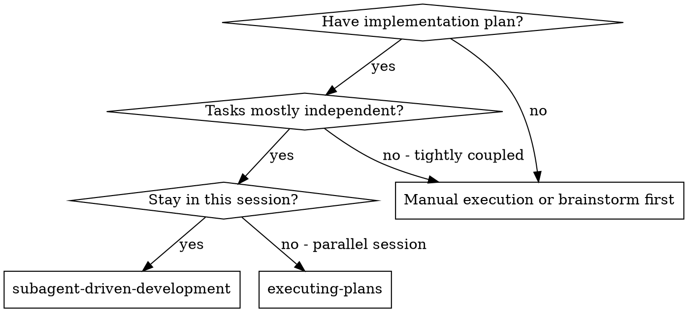

# Subagent-Driven Development

Execute plan by dispatching fresh subagent per task, with two-stage review after each: spec compliance review first, then code quality review.

**Why subagents:** Delegate tasks to specialized agents with isolated context. They never inherit your session history — you construct exactly what they need. Preserves your own context for coordination.

**Core principle:** Fresh subagent per task + two-stage review (spec then quality) = high quality, fast iteration

## Dispatch Modes

Chosen during Execution Handoff in writing-plans.

### Team Agents — Native Team (recommended for coordinated work)

Use when tasks have cross-dependencies, need inter-agent communication, or span multiple layers. Creates a real Agent Team using TeamCreate/SendMessage/shared TaskList.

**REQUIRED SUB-SKILL:** Use man:agent-teams for the full Team Workflow.

| Task Type | subagent_type | Agent | Model |
|-----------|--------------|-------|-------|
| Implement | `man:implementer` | triệu-vân | Sonnet |
| Debug | `man:debugger` | bàng-thống | Opus |
| Code review | `man:code-reviewer` | pháp-chính | Opus |
| Security review | `man:secure-reviewer` | tư-mã-ý | Opus |
| Explore codebase | `man:codebase-explorer` | gia-cát-lượng | Sonnet |
| Quick fix | `man:quick-fix` | trương-phi | Sonnet |
| Tests | `man:test-engineer` | hoàng-trung | Sonnet |
| Docs | `man:doc-writer` | mã-lương | Sonnet |
| Journal | `man:journal-writer` | quan-vũ | Sonnet |
| Release | `man:release-prep` | lưu-bị | Opus |
| Final approval | `man:final-approver` | tào-tháo | Opus |

**Cost:** ~3-4x single session (persistent teammates). Use only when coordination justifies cost.

### Team Agents — Fire-and-Forget (recommended for independent tasks)

Same role-based agents, dispatched as independent subagents via `Agent(subagent_type="man:...")`. No TeamCreate, no SendMessage, no shared TaskList. Each runs in isolation, returns result, exits.

**IMPORTANT:** Always use `man:` prefix (e.g., `subagent_type: "man:implementer"`). Without prefix, plugins like cavecrew may intercept the dispatch.

**Plugins are tools, not agents.** Cavecrew, context-mode, and other plugins provide supporting capabilities that team agents can leverage. They do not replace team agents.

### Generic Subagent

Dispatch using generic `subagent_type` without `man:` prefix. Useful when no specialized agent exists.

### Inline Execution

No subagent dispatch. Execute in current session using man:executing-plans.

## When to Use



**vs. Executing Plans (parallel session):** Same session (no context switch). Fresh subagent per task (no context pollution). Two-stage review after each task. Faster iteration (no human-in-loop between tasks).

## The Process

Per task: dispatch implementer → answer questions if any → implementer implements+tests+commits → spec review → fix spec gaps if needed → quality review → fix quality issues if needed → reflection checkpoint (every 3rd task or 2+ rejections) → mark complete. After all tasks: final code review → man:finishing-a-development-branch.

See `references/process-diagram-and-replanning.md` for full DOT process diagram and replanning procedures (REPLAN_TASK, REPLAN_PHASE, failure-triggered replan).

## Metacognition: Reflection Checkpoints

**Trigger conditions (any):** every 3rd completed task · task had 2+ review rejection cycles · task touched 5+ files · controller uncertain about direction.

**When triggered:** Dispatch reflection subagent using `./reflection-prompt.md`.

| Verdict | Meaning | Controller action |
|---------|---------|-------------------|
| `PROCEED` | Implementation solid | Log scores, continue to next task |
| `REPLAN_TASK` | This task needs a different approach | See references/process-diagram-and-replanning.md |
| `REPLAN_PHASE` | Plan itself has issues affecting multiple tasks | See references/process-diagram-and-replanning.md |

**Tracking:** Maintain running tally of reflection scores. If confidence trends downward across 3+ consecutive reflections, trigger phase-level replan regardless of individual verdicts.

## Model Selection

**Canonical reference:** See man:effort-tuning for the full task→model decision table and cost impact.

**Quick rule:** In Team Agents mode, each agent has its own model (see Dispatch Modes table). In generic mode: implementer → Sonnet, reviewer → Opus, research → Haiku. Upgrade if subagent returns BLOCKED; downgrade if task is mechanical.

## Passing Context to Dependent Tasks

When Task N depends on earlier tasks, include prior-task context in the dispatch prompt. The implementer has zero knowledge of what earlier tasks did.

**Include:** summary of relevant changes, git diff excerpt, specific impact ("function X is now async").

```bash
git log --oneline <base>..HEAD          # what was done
git diff <base>..HEAD -- src/           # what changed in source
```

Include relevant parts under `## Changes from Prior Tasks` section.

## Handling Implementer Status

**DONE:** Proceed to spec compliance review.

**DONE_WITH_CONCERNS:** Read concerns. If about correctness/scope, address before review. If observational, note and proceed.

**NEEDS_CONTEXT:** Provide missing context and re-dispatch.

**BLOCKED:**

| Signal | Type | Action |
|--------|------|--------|
| Missing context (file path, type signature) | **Context gap** | Provide, re-dispatch same model |
| Task too complex for model | **Capability limit** | Re-dispatch more capable model |
| Task spans too many concerns | **Scope overload** | Break into pieces, dispatch sequentially |
| Plan assumption wrong | **Plan gap** | Skip task, escalate gap to human |
| Multiple tasks failing for same root cause | **Plan defect** | STOP, escalate to human |

**Escalation format:**
```
COURSE CORRECTION NEEDED
Task: [which task]
Expected: [what the plan assumed]
Actual: [what the implementer found]
Impact: [which other tasks are affected]
Options: A) ... B) ... C) Revise plan from task N onward
Recommend: [your pick and why]
```

See `references/attempt-history-redispatch.md` for re-dispatch prompt format with prior attempt history.

## Structured Agent Output

See `references/structured-output-formats.md` for full YAML schemas for all four report types (implementer, spec reviewer, quality reviewer, reflection) and controller parsing rules.

## Context Management

After every 3 completed tasks (or long review loop), if context above 60%, compact with:
```
/compact Keep: executing plan at <plan-file-path> via subagent-driven-development.
Tasks 1-3 complete. Next: Task 4. Branch: <branch>. Worktree: <path>.
Key decisions: <decisions that affect later tasks>.
```

See man:context-management for full decision framework.

## Prompt Templates

- `./implementer-prompt.md` — dispatch implementer subagent
- `./spec-reviewer-prompt.md` — dispatch spec compliance reviewer
- `./code-quality-reviewer-prompt.md` — dispatch code quality reviewer
- `./reflection-prompt.md` — dispatch metacognition reflection subagent

See `references/example-workflow.md` for full end-to-end worked example.

## Red Flags

**Never:**
- Skip reviews (spec compliance OR code quality)
- Start code quality review before spec compliance is ✅
- Dispatch multiple implementation subagents in parallel (conflicts)
- Make subagent read plan file (provide full text instead)
- Accept "close enough" on spec compliance
- Move to next task while either review has open issues

**If reviewer finds issues:** Implementer (same subagent) fixes → reviewer reviews again → repeat until approved.

## Worktree Isolation

When dispatching ≥2 independent implementer tasks in parallel, each runs in its own git worktree.

```bash
python scripts/worktree-spawn.py <task-id>   # returns absolute path for implementer
python scripts/worktree-cleanup.py <task-id> --merge-to main  # after complete
```

See `skills/using-git-worktrees/SKILL.md` for full conventions.

## Integration

- **man:using-git-worktrees** — REQUIRED: set up isolated workspace before starting
- **man:writing-plans** — creates the plan this skill executes
- **man:code-review-workflow** — code review template for reviewer subagents
- **man:finishing-a-development-branch** — complete development after all tasks
- **man:executing-plans** — alternative: parallel session instead of same-session execution

## Agent Dispatch Reference

```
Agent(subagent_type="man:implementer", prompt="...")
Agent(subagent_type="man:code-reviewer", prompt="...")
Agent(subagent_type="man:debugger", prompt="...")
Agent(subagent_type="man:test-engineer", prompt="...")
```

Each agent file encodes discipline rules, model, hooks, and report format. You provide: task text, context (architectural fit, dependencies), acceptance criteria (test command + expected result).
