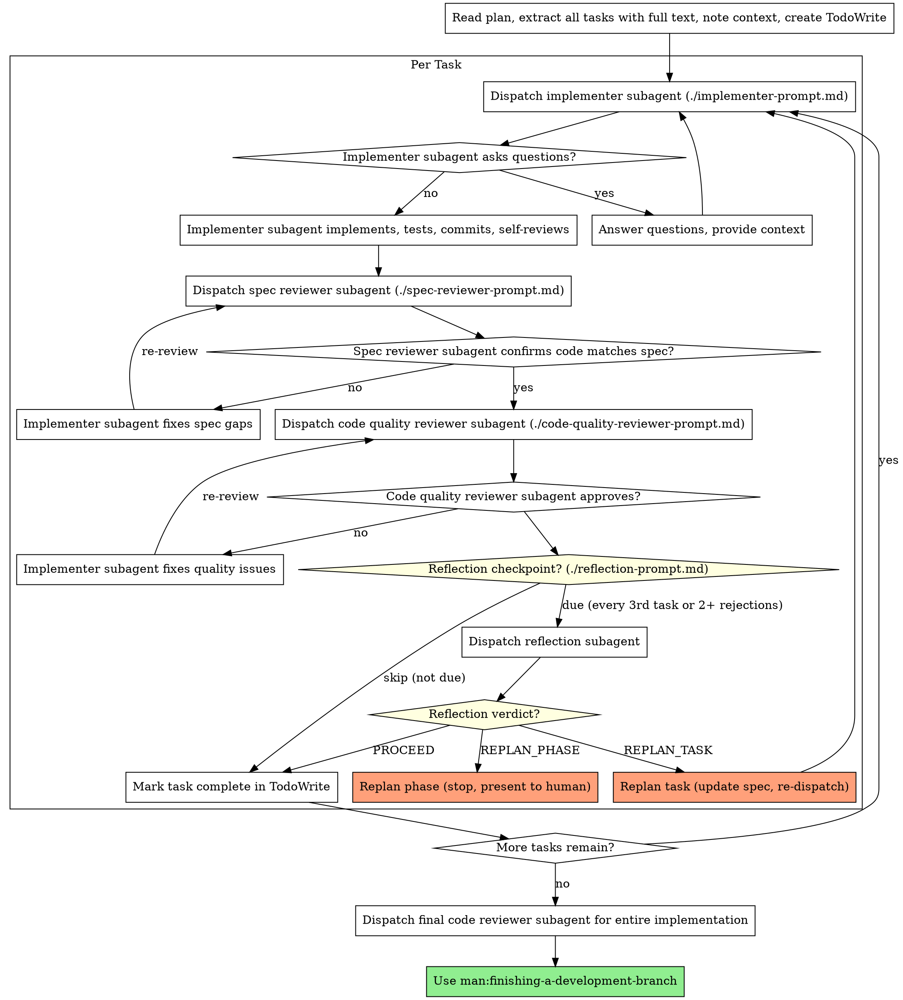

# Process Diagram and Replanning Details

## Full Process Diagram

## Replanning on Failure

Replanning activates when reflection returns `REPLAN_TASK` or `REPLAN_PHASE`, or when the same task fails review 3+ times.

### Task-Level Replan (REPLAN_TASK)

1. Read reflection findings — identify root cause (wrong approach, missing context, bad assumptions)
2. Update the task spec in the plan file:
   - Add a `## Revised Approach` section with new constraints from reflection
   - Preserve original spec for traceability — don't delete, add revision below
3. Re-dispatch implementer with: updated spec + reflection findings + prior attempt's diff summary
4. Reset review cycle counter to 0

**Max replans per task:** 2. If a task triggers REPLAN_TASK twice, escalate to human.

### Phase-Level Replan (REPLAN_PHASE)

1. **STOP** dispatching new tasks immediately
2. Compile all reflection findings into a summary
3. Present summary to human partner with options: revise remaining tasks / re-decompose / abort
4. Wait for human decision. Resume only after plan file is updated.

### Failure-Triggered Replan (no reflection needed)

If a task enters its 3rd review rejection cycle (spec or quality):
1. STOP the review loop
2. Run reflection regardless of whether it was due
3. Follow REPLAN_TASK or REPLAN_PHASE based on reflection verdict
4. If reflection says PROCEED despite 3 rejections: escalate to human
