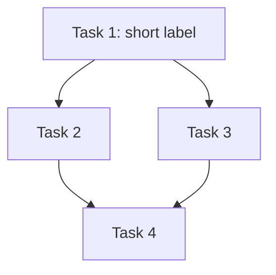

# Writing Plans

## Overview

Write comprehensive implementation plans assuming the engineer has zero context for our codebase and questionable taste. Document everything they need to know: which files to touch for each task, code, testing, docs they might need to check, how to test it. Give them the whole plan as bite-sized tasks. DRY. YAGNI. TDD. Frequent commits.

Assume they are a skilled developer, but know almost nothing about our toolset or problem domain. Assume they don't know good test design very well.

**Announce at start:** "I'm using the writing-plans skill to create the implementation plan."

**Context:** This should be run in a dedicated worktree (created by brainstorming skill).

**Save plans to:** `docs/mankit/plans/YYYY-MM-DD-<feature-name>.md`
- (User preferences for plan location override this default)
- Do NOT commit plan files to git — they are working documents for implementation, not permanent project documentation

## Scope Check

If the spec covers multiple independent subsystems, it should have been broken into sub-project specs during brainstorming. If it wasn't, suggest breaking this into separate plans — one per subsystem. Each plan should produce working, testable software on its own.

## Project Context

Before writing the plan, check if `docs/mankit/project-context.md` exists. If it does:
- Read it and use its constraints, conventions, and architecture as baseline context
- Include relevant constraints in the plan header so implementers don't violate them
- If the plan contradicts a hard constraint in project-context.md, flag this to the user

If it doesn't exist and the project is non-trivial, suggest running `/man-explore` or `generate-project-context` first.

## Existing Documentation Scan

Before defining tasks, scan `docs/**/*.md` for documentation relevant to the feature area:

- **Existing specs/designs** — decisions already made, constraints already established
- **Architecture notes** — current structure, patterns, conventions
- **Feature docs** — functions, components, and logic already documented with file locations

If docs describe functions or components you'll be modifying, reference them in the relevant task's **Files** section so the implementer has full context. If docs map out file locations, use those as the starting point for your file structure.

If no docs exist for the area, note this — it means this is either a new feature or a legacy area without documentation.

## File Structure

Before defining tasks, map out which files will be created or modified and what each one is responsible for. This is where decomposition decisions get locked in.

- Design units with clear boundaries and well-defined interfaces. Each file should have one clear responsibility.
- You reason best about code you can hold in context at once, and your edits are more reliable when files are focused. Prefer smaller, focused files over large ones that do too much.
- Files that change together should live together. Split by responsibility, not by technical layer.
- In existing codebases, follow established patterns. If the codebase uses large files, don't unilaterally restructure - but if a file you're modifying has grown unwieldy, including a split in the plan is reasonable.

This structure informs the task decomposition. Each task should produce self-contained changes that make sense independently.

## Bite-Sized Task Granularity

**Each step is one action (2-5 minutes):**
- "Write the failing test" - step
- "Run it to make sure it fails" - step
- "Implement the minimal code to make the test pass" - step
- "Run the tests and make sure they pass" - step
- "Commit" - step

## Plan Document Header

**Every plan MUST start with this header:**

```markdown
# [Feature Name] Implementation Plan

> **For agentic workers:** REQUIRED SUB-SKILL: Use man:subagent-driven-development (recommended) or man:executing-plans to implement this plan task-by-task. Steps use checkbox (`- [ ]`) syntax for tracking.

**Goal:** [One sentence describing what this builds]

**Architecture:** [2-3 sentences about approach]

**Tech Stack:** [Key technologies/libraries]

## Task DAG



Edge `A --> B` means **B depends on A** — B cannot start until A is completed.

Render rules:
- Use task numbers as node IDs (`T1`, `T2`, ...).
- Independent tasks have no incoming edges — these are the wave-1 spawn candidates.
- A task with multiple incoming edges (AND-semantics) only unblocks after every parent completes.
- If your DAG is fully linear (T1 → T2 → T3 → ...), you don't need a team — sequential dispatch is fine. Include the DAG anyway so the lead can see it.

---
```

## Task Structure

````markdown
### Task N: [Component Name]

**Depends on:** Task M, Task K  *(or `none` for wave-1 tasks)*

**Files:**
- Create: `exact/path/to/file.py`
- Modify: `exact/path/to/existing.py:123-145`
- Test: `tests/exact/path/to/test.py`

- [ ] **Step 1: Write the failing test**

```python
def test_specific_behavior():
    result = function(input)
    assert result == expected
```

- [ ] **Step 2: Run test to verify it fails**

Run: `pytest tests/path/test.py::test_name -v`
Expected: FAIL with "function not defined"

- [ ] **Step 3: Write minimal implementation**

```python
def function(input):
    return expected
```

- [ ] **Step 4: Run test to verify it passes**

Run: `pytest tests/path/test.py::test_name -v`
Expected: PASS

- [ ] **Step 5: Commit**

```bash
git add tests/path/test.py src/path/file.py
git commit -m "feat: add specific feature"
```
````

**Cold-Execution Rule:** Every task MUST be self-contained. A fresh agent with zero context from other tasks must be able to execute it. This means:
- Repeat type definitions, function signatures, and file paths — even if defined in an earlier task
- Never say "similar to Task N" — repeat the code
- Include the full import path for any symbol from another file
- If a task modifies a file created in a prior task, include the relevant sections of that file as context

## Test-Update Tasks Need Extra Detail

When a task is "update tests" or "fix tests" that depends on changes from prior tasks, the plan MUST include:

1. **Exact test file paths** — not "update the tests", but `tests/socket.service.test.ts`
2. **What changed that breaks tests** — "Task 2 made `emitNextTeam` async, so callers need `await`"
3. **Specific mock/assertion changes** — show the before→after for each test change
4. **Targeted test command** — `npx jest socket.service.test --no-coverage --forceExit`, never the full suite
5. **Expected test count** — "Expected: 12/12 PASS"

A vague test task ("update tests") is the #1 cause of implementer thrashing. The implementer has no context from prior tasks — if the plan doesn't spell out exactly what changed and how tests should adapt, the agent will run the full suite, see failures it doesn't understand, and loop for 20+ minutes.

**Bad:** `Task 5: Update tests for the new ranking feature`

**Good:**
```markdown
Task 5: Update socket.service.test.ts for async emitNextTeam

Files:
- Modify: `tests/socket.service.test.ts`

Context: Tasks 2-3 changed `emitNextTeam` from sync to async and added
`ranking` parameter. Tests that call `emitNextTeam` need `await` and
mock for `buildRanking`.

- [ ] Step 1: Add `buildRanking` mock
  ```ts
  jest.spyOn(rankingService, 'buildRanking').mockResolvedValue(mockRanking);
  ```

- [ ] Step 2: Update emitNextTeam call sites to use await
  ```ts
  // Before:
  service.emitNextTeam(gameId);
  // After:
  await service.emitNextTeam(gameId);
  ```

- [ ] Step 3: Run targeted test
  Run: `npx jest socket.service.test --no-coverage --forceExit`
  Expected: 12/12 PASS
```

## No Placeholders

Every step must contain the actual content an engineer needs. These are **plan failures** — never write them:
- "TBD", "TODO", "implement later", "fill in details"
- "Add appropriate error handling" / "add validation" / "handle edge cases"
- "Write tests for the above" (without actual test code)
- "Similar to Task N" (repeat the code — the engineer may be reading tasks out of order)
- Steps that describe what to do without showing how (code blocks required for code steps)
- References to types, functions, or methods not defined in any task

## Remember
- Exact file paths always
- Complete code in every step — if a step changes code, show the code
- Exact commands with expected output
- DRY, YAGNI, TDD, frequent commits

## Self-Review

After writing the complete plan, look at the spec with fresh eyes and check the plan against it. This is a checklist you run yourself — not a subagent dispatch.

**1. Spec coverage:** Skim each section/requirement in the spec. Can you point to a task that implements it? List any gaps.

**2. Placeholder scan:** Search your plan for red flags — any of the patterns from the "No Placeholders" section above. Fix them.

**3. Type consistency:** Do the types, method signatures, and property names you used in later tasks match what you defined in earlier tasks? A function called `clearLayers()` in Task 3 but `clearFullLayers()` in Task 7 is a bug.

**4. Dependency coherence:** For each task with `Depends on: Task N`, verify Task N actually produces what this task consumes. If Task 3 imports a function from Task 2's file, does Task 2 actually export it? Trace every cross-task reference.

**5. Implementer context sufficiency:** Read each task as if you have ZERO context from other tasks. Does the task contain everything needed to execute it in isolation? Common failures:
- References "the type we defined earlier" without showing it
- Says "update the test" without showing what changed and why
- Uses a variable/function from another task without repeating its signature
- Assumes the implementer knows which file a symbol lives in

**6. DAG executability:** Walk the dependency graph. Are there circular dependencies? Can wave-1 tasks (no dependencies) actually start without any prior work? Is there a task that depends on 3+ other tasks — if so, is it because it genuinely needs all of them, or because the decomposition is too coarse?

**7. Cold-execution test:** For each task, imagine a FRESH agent that has never seen any other task in this plan. Can it execute this task using ONLY the information in the task description? Common cold-execution failures:
- Task says "update the type we defined" without showing the type definition
- Task references a function from Task 2 without repeating its signature and file path
- Task says "similar to Task 3" instead of repeating the relevant code
- Task uses a variable name introduced in another task without declaring it
- Task says "modify the file from Task 1" without stating the file path

For each failure: copy the missing context into the task. The implementer agent starts fresh — it has ZERO memory of other tasks.

If you find issues, fix them inline. No need to re-review — just fix and move on. If you find a spec requirement with no task, add the task.

## Execution Handoff

<MANDATORY-GATE>
After saving the plan, you MUST present the three options below and STOP.
Do NOT spawn agents, create teams, or write code until the user explicitly picks an option.
Wait for the user's reply before doing anything else.
</MANDATORY-GATE>

Present this message verbatim (fill in the filename):

---
Plan complete and saved to `docs/mankit/plans/<filename>.md`.

**Three execution options — pick one:**

**1. Team Agents (recommended)** — Role-based agents (implementer, reviewer, tester) run in parallel. Best for multi-task plans with parallel work.

**2. Subagent-Driven** — Fresh generic subagent per task, sequential with review between tasks. Lighter-weight.

**3. Inline Execution** — Execute tasks in this session with checkpoints. Slowest but most control.

Which approach?
---

**STOP HERE. Wait for the user's response before reading further.**

---

**If Team Agents chosen:**

You are the **team lead**. Use the native Agent Teams API. Follow this exact sequence:

1. **Create team** — name derived from plan:
   ```
   TeamCreate({
     team_name: "<feature-name>",
     description: "Implement <plan goal>"
   })
   ```

2. **Create shared task list** — convert every plan task to a TaskCreate call with owner:
   ```
   TaskCreate({ subject: "Task 1: <name>", description: "<full task spec from plan>" })
   TaskCreate({ subject: "Task 2: <name>", description: "<full task spec from plan>" })
   ...
   ```
   Set dependencies with TaskUpdate:
   ```
   TaskUpdate({ id: 2, blockedBy: [1] })  // if Task 2 depends on Task 1
   ```

3. **Spawn teammates** based on task types present in the plan:
   - Has implementation tasks → spawn `man:implementer` teammate
   - Has test tasks → spawn `man:test-engineer` teammate
   - Has debug tasks → spawn `man:debugger` teammate
   - Always spawn `man:code-reviewer` for final review

   ```
   Agent({
     team_name: "<feature-name>",
     name: "implementer",
     subagent_type: "man:implementer",
     prompt: "You are the implementer. Check TaskList for tasks assigned to you. For each: read the task description (contains full spec), implement with TDD, mark DONE via TaskUpdate, then check for more work."
   })
   ```

4. **Assign tasks** to teammates:
   ```
   TaskUpdate({ id: 1, owner: "implementer" })
   TaskUpdate({ id: 2, owner: "tester" })
   ```

5. **Monitor & coordinate** — messages arrive automatically. Use SendMessage to:
   - Share context between teammates when tasks have cross-dependencies
   - Redirect reviewer findings to the implementer
   - Unblock teammates waiting on information

6. **Wrap up** — when all tasks DONE:
   - SendMessage shutdown to all teammates
   - Run full test suite
   - Ask user to commit

**Full reference:** See man:agent-teams for the complete Team Workflow, Coordination Patterns, and Lead Responsibilities.

**If Subagent-Driven chosen:**
- **REQUIRED SUB-SKILL:** Use man:subagent-driven-development
- Fresh subagent per task + two-stage review

**If Inline Execution chosen:**
- **REQUIRED SUB-SKILL:** Use man:executing-plans
- Batch execution with checkpoints for review

## Codebase-Explorer Integration

If `/man-explore` was run before invoking this skill, the user will paste the
codebase-explorer output. When that output is present:
- Use the **Touch points** table as the starting point for each task's `Files:` section.
- Cite the conventions in the plan header so implementers follow them.
- Resolve any items in the **Questions for the planner** section before writing tasks.

If no codebase-explorer output is provided and the feature is non-trivial, ask the
user whether to run `/man-explore` first.
