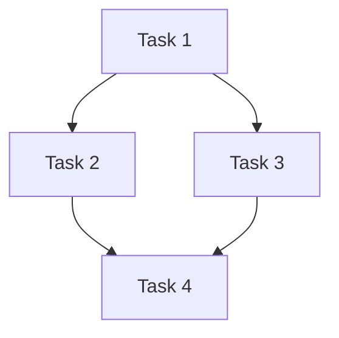

# Writing Plans

## Overview

Write comprehensive implementation plans assuming the engineer has zero context for our codebase and questionable taste. Document everything they need to know: which files to touch for each task, code, testing, docs they might need to check, how to test it. Give them the whole plan as bite-sized tasks. DRY. YAGNI. TDD. Frequent commits.

Assume they are a skilled developer, but know almost nothing about our toolset or problem domain. Assume they don't know good test design very well.

**Announce at start:** "I'm using the writing-plans skill to create the implementation plan."

**Context:** This should be run in a dedicated worktree (created by brainstorming skill).

**Save plans to:** `docs/mankit/plans/YYYY-MM-DD-<feature-name>.md`
- (User preferences for plan location override this default)
- Do NOT commit plan files to git — they are working documents for implementation, not permanent project documentation

## Scope Check

If the spec covers multiple independent subsystems, suggest breaking this into separate plans — one per subsystem. Each plan should produce working, testable software on its own.

## Project Context

Before writing the plan, check if `docs/mankit/project-context.md` exists. If it does, read it and use its constraints as baseline context. Include relevant constraints in the plan header. If plan contradicts a hard constraint, flag to user.

If it doesn't exist and the project is non-trivial, suggest running `/man-explore` or `generate-project-context` first.

## Existing Documentation Scan

Before defining tasks, scan `docs/**/*.md` for: existing specs/decisions, architecture notes, feature docs with file locations. Reference relevant docs in task **Files** sections.

## File Structure

Before defining tasks, map out which files will be created or modified. Design units with clear boundaries. Prefer smaller, focused files. Files that change together should live together. Follow established patterns in existing codebases.

## Bite-Sized Task Granularity

**Each step is one action (2-5 minutes):**
- "Write the failing test" — step
- "Run it to make sure it fails" — step
- "Implement the minimal code to make the test pass" — step
- "Run the tests and make sure they pass" — step
- "Commit" — step

## Plan Document Header

**Every plan MUST start with this header:**

```markdown
# [Feature Name] Implementation Plan

> **For agentic workers:** REQUIRED SUB-SKILL: Use man:subagent-driven-development (recommended) or man:executing-plans to implement this plan task-by-task. Steps use checkbox (`- [ ]`) syntax for tracking.

**Goal:** [One sentence describing what this builds]
**Architecture:** [2-3 sentences about approach]
**Tech Stack:** [Key technologies/libraries]

## Mandatory Reading

| Priority | File | Lines | Why |
|---|---|---|---|
| P0 (critical) | `path/to/file` | 1-50 | Core pattern to follow |

## Patterns to Mirror

### NAMING
// SOURCE: [file:lines]
[actual code snippet]

### ERROR_HANDLING  TEST_STRUCTURE
// SOURCE: [file:lines]
[actual snippets]

---

## Task DAG



Edge `A --> B` means B depends on A. Independent tasks (no incoming edges) = wave-1 spawn candidates. Fully linear DAG = no team needed, sequential dispatch fine.

---
```

## Task Structure

See `references/task-structure-templates.md` for the full task template (Steps 1-5 with code), Cold-Execution Rule details, dependent task example (async emitNextTeam), screenshot-based verification template, and plan document header template.

**Core rules:**

**Cold-Execution Rule:** Every task MUST be self-contained. A fresh agent with zero context must execute it. Repeat type definitions, function signatures, file paths — never say "similar to Task N". Include full import paths. Include relevant sections of files created in prior tasks.

**Test-Update Tasks:** Must include: exact test file paths, what changed that breaks tests, specific mock/assertion before→after, targeted test command, expected test count. A vague "update tests" task is the #1 cause of implementer thrashing.

**No Placeholders:** Never write "TBD", "TODO", "implement later", "add appropriate error handling", "similar to Task N", or steps without code. Every step must contain actual content.

## Remember
- Exact file paths always
- Complete code in every step — if a step changes code, show the code
- Exact commands with expected output
- DRY, YAGNI, TDD, frequent commits

## Self-Review

After writing the complete plan, check against the spec yourself (not a subagent dispatch):

1. **Spec coverage:** Can you point to a task for each requirement? List gaps.
2. **Placeholder scan:** Search for patterns from "No Placeholders". Fix them.
3. **Type consistency:** Do types, method signatures, and property names match across tasks?
4. **Dependency coherence:** For each `Depends on: Task N`, verify Task N produces what this task consumes.
5. **Implementer context sufficiency:** Read each task with ZERO context from other tasks. Does it contain everything needed?
6. **DAG executability:** No circular deps? Wave-1 tasks can start without prior work?
7. **Cold-execution test:** For each task, imagine a FRESH agent. Common failures: "update the type we defined" without showing it, "similar to Task 3" instead of repeating code, uses variable from another task without declaring it.

Fix issues inline. No need to re-review — just fix and move on.

## Execution Handoff

<MANDATORY-GATE>
After saving the plan, you MUST present the three options below and STOP.
Do NOT spawn agents, create teams, or write code until the user explicitly picks an option.
Wait for the user's reply before doing anything else.
</MANDATORY-GATE>

Before presenting options, compute a **Confidence Score (1-10)**: likelihood this plan can be implemented in a single pass without questions. Deduct for: unclear requirements (-2), missing type definitions (-1), unknown external APIs (-1), untested patterns (-1), complex cross-task dependencies (-1).

Present this message verbatim (fill in filename and score):

---
Plan complete and saved to `docs/mankit/plans/<filename>.md`.

**Confidence Score: [N]/10** — [one-line reason if < 8]

**Three execution options — pick one:**

**1. Team Agents (recommended)** — Role-based agents (implementer, reviewer, tester) run in parallel. Best for multi-task plans with parallel work.

**2. Subagent-Driven** — Fresh generic subagent per task, sequential with review between tasks. Lighter-weight.

**3. Inline Execution** — Execute tasks in this session with checkpoints. Slowest but most control.

Which approach?
---

**STOP HERE. Wait for the user's response before reading further.**

---

**If Team Agents chosen:** See man:agent-teams for the full Team Workflow. Summary: TeamCreate → TaskCreate per plan task → TaskUpdate for blockedBy dependencies → spawn role-based teammates (man:implementer, man:test-engineer, man:code-reviewer) → monitor via TaskList → coordinate via SendMessage → shutdown when all DONE.

**If Subagent-Driven chosen:**
- **REQUIRED SUB-SKILL:** Use man:subagent-driven-development
- Fresh subagent per task + two-stage review

**If Inline Execution chosen:**
- **REQUIRED SUB-SKILL:** Use man:executing-plans
- Batch execution with checkpoints for review

## Codebase-Explorer Integration

If `/man-explore` output is present, use its **Touch points** table for each task's `Files:` section, cite its conventions in the plan header, and resolve its **Questions for the planner** before writing tasks.

If no codebase-explorer output, do inline research for these 4 categories:

| Category | Search | What to capture |
|---|---|---|
| **Similar implementations** | Files/functions resembling the planned feature | File paths, function signatures |
| **Naming conventions** | How files, classes, functions are named | Patterns with examples |
| **Error handling** | How errors are caught/propagated/returned | Actual code snippet |
| **Test patterns** | Test file locations, setup/teardown, assertion style | Actual test snippet |

Record findings in a discovery table and use to populate **Patterns to Mirror** and **Mandatory Reading** in the plan header.
