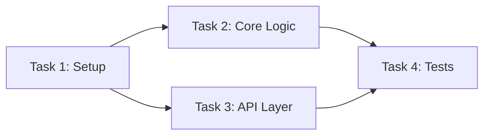

## Task Structure Template

````markdown
### Task N: [Component Name]

**Depends on:** Task M, Task K  *(or `none` for wave-1 tasks)*

**Files:**
- Create: `exact/path/to/file.py`
- Modify: `exact/path/to/existing.py:123-145`
- Test: `tests/exact/path/to/test.py`

- [ ] **Step 1: Write the failing test**

```python
def test_specific_behavior():
    result = function(input)
    assert result == expected
```

- [ ] **Step 2: Run test to verify it fails**

Run: `pytest tests/path/test.py::test_name -v`
Expected: FAIL with "function not defined"

- [ ] **Step 3: Write minimal implementation**

```python
def function(input):
    return expected
```

- [ ] **Step 4: Run test to verify it passes**

Run: `pytest tests/path/test.py::test_name -v`
Expected: PASS

- [ ] **Step 5: Commit**

```bash
git add tests/path/test.py src/path/file.py
git commit -m "feat: add specific feature"
```
````

**Cold-Execution Rule:** Every task MUST be self-contained. A fresh agent with zero context from other tasks must be able to execute it. This means:
- Repeat type definitions, function signatures, and interface shapes from earlier tasks if needed
- Include exact file paths (never "the auth module" — always `src/auth/validate.ts`)
- Include the targeted test command (never the full suite)
- Include expected pass count

## No Placeholders

Every step must contain the actual content an engineer needs. These are **plan failures** — never write them:
- "TBD", "TODO", "implement later", "fill in details"
- "Add appropriate error handling" / "add validation" / "handle edge cases"
- "Write tests for the above" (without actual test code)
- "Similar to Task N" (repeat the code — the engineer may be reading tasks out of order)
- Steps that describe what to do without showing how (code blocks required for code steps)
- References to types, functions, or methods not defined in any task

## Dependent Task Example

```markdown
Task 5: Update socket.service.test.ts for async emitNextTeam

Files:
- Modify: `tests/socket.service.test.ts`

Context: Tasks 2-3 changed `emitNextTeam` from sync to async and added
`ranking` parameter. Tests that call `emitNextTeam` need `await` and
mock for `buildRanking`.

- [ ] Step 1: Add `buildRanking` mock
  ```ts
  jest.spyOn(rankingService, 'buildRanking').mockResolvedValue(mockRanking);
  ```

- [ ] Step 2: Update emitNextTeam call sites to use await
  ```ts
  // Before:
  service.emitNextTeam(gameId);
  // After:
  await service.emitNextTeam(gameId);
  ```

- [ ] Step 3: Run targeted test
  Run: `npx jest socket.service.test --no-coverage --forceExit`
  Expected: 12/12 PASS
```

## Plan Document Header Template

```markdown
# Plan: [Feature Name]

**Branch:** `feature/[feature-name]`
**Base:** `main`
**Estimated tasks:** N
**Patterns to Mirror:** [file:line references from discovery]

## Mandatory Reading
| File | Lines | Why |
|------|-------|-----|
| `src/auth/validate.ts` | 1-50 | Pattern to follow |

## Discovery Table
| Category | File:Lines | Pattern | Key Snippet |
|---|---|---|---|
| Errors | `src/lib/error.ts:10` | AppError class | `throw new AppError(...)` |
| Tests | `tests/user.test.ts:1` | describe/it + beforeEach | `beforeEach(() => reset())` |
| Similar | `src/features/auth.ts:45` | Feature pattern | `async function handle(...)` |

## Task DAG



## Tasks

[Task 1]
[Task 2]
...
```

## Screenshot-Based Verification

Use screenshots for visual regression testing:

```markdown
### Steps
1. Click the checkbox on the first task
   - Expected: Task shows strikethrough animation, moves to "completed" section
   - Check: Console should have no errors
   - Check: Network should show PATCH /api/tasks/:id with { status: "completed" }

2. Click undo within 3 seconds
   - Expected: Task returns to original position
   - Check: Network should show PATCH /api/tasks/:id with { status: "pending" }

3. Rapidly toggle the same task 5 times
   - Expected: No visual glitches, final state is consistent
   - Check: No console errors, no duplicate network requests
   - Check: DOM should show exactly one instance of the task

### Verification
- [ ] All steps completed without console errors
- [ ] Network requests are correct and not duplicated
- [ ] Visual state matches expected behavior
- [ ] Accessibility: task status changes are announced to screen readers
```
